# i18n Implementation Status

**Project**: Nagare Internationalization Support\
**Status**: 🌿 Active\
**Started**: 2024-12-01\
**Type**: Feature Implementation

## Current Phase

[Planning] → [**Executing**] → [Complete] ▲

## Progress Overview

```mermaid
graph LR
    A[🌱 Started] --> B[🌿 Active]
    B --> C[🌳 Review]
    C --> D[🍃 Complete]
    style B fill:#90EE90
```

## Documents

- `i18n-implementation.md` - Implementation plan and progress tracking
- `i18n-integration-strategy.md` - Technical integration strategy

## Objectives

1. Add comprehensive internationalization support to Nagare
2. Support multiple languages for CLI messages and documentation
3. Maintain backward compatibility
4. Create extensible architecture for future language additions

## Next Steps

- [ ] Review and finalize implementation plan
- [ ] Begin core i18n module development
- [ ] Implement TypeScript interfaces
- [ ] Create initial language files (en, ja, es)

## Notes

- Following Deno's i18n patterns for consistency
- Using TypeScript's type system for compile-time safety
- Focusing on maintainability and ease of translation
