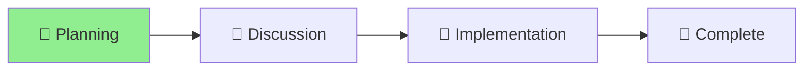

# Enhanced Hooks Proposal Status

## Project: Enhanced Lifecycle Hooks for Nagare

**Started**: 2025-01-09 **Status**: 🌱 Planning **Type**: Feature Proposal

## Current Phase

[**Planning**] → [Discussion] → [Implementation] → [Complete] ▲

## Progress

Week 1/1 ████████░░░░░░░░░░░░ 40% 🌱

## Status Diagram

## Objectives

- [ ] Document comprehensive hook proposal
- [ ] Gather feedback on priority hooks
- [ ] Create implementation plan
- [ ] Define hook context structure

## Recent Activity

- Created comprehensive proposal for 15+ new lifecycle hooks
- Defined hook categories and use cases
- Provided real-world implementation examples

## Next Steps

1. Review proposal with team
2. Prioritize which hooks to implement first
3. Create proof of concept for top 3 hooks
