# Nagare Release Error Fix Status

## Project: Fix Nagare Release Initialization and CLI Argument Parsing

**Started**: 2025-01-09 **Status**: 🌱 Planning **Type**: Bug Fix

## Current Phase

[Planning] → [Execution] → [**Testing**] → [Complete] ▲

## Progress

Week 1/1 ██████████████████░░ 90% 🌳

## Status Diagram

```mermaid
graph LR
    A[🌱 Planning] --> B[🌿 Execution]
    B --> C[🌳 Testing]
    C --> D[🍃 Complete]
    style C fill:#90EE90
```



## Problem Analysis

Based on the error trace, there are two critical issues:

### Issue 1: Missing i18n Locales

```
❌ Failed to initialize i18n: Failed to load fallback locale en: NotFound: No such file or directory (os error 2): readfile './locales/en.yaml'
```

### Issue 2: CLI Argument Parsing Problem

```
Task nagare deno run -A nagare-launcher.ts "minor" "--" "--skip-confirmation"
```

The `--` separator is being passed as a literal argument, causing parsing confusion.

## Root Causes

1. **Missing Locale Files**: Nagare expects `./locales/en.yaml` but it's not found
2. **CLI Argument Parsing**: The `--skip-confirmation` flag isn't being parsed correctly due to `--`
   separator

## Objectives

- [x] Investigate missing locale files in Nagare
- [x] Fix CLI argument parsing for `--skip-confirmation`
- [x] Test release process works correctly
- [ ] Ensure backwards compatibility

## Completed Work

### ✅ Fixed Issues

1. **i18n Initialization**: Updated `cli.ts` to properly resolve localesDir path for JSR imports
2. **CLI Argument Parsing**: Added proper handling for "--" separator in argument parsing
3. **Testing**: Verified both fixes work correctly with CLI testing

### 🔍 Test Results

- `deno run --allow-all cli.ts --help` ✅ Works - i18n properly initialized
- `deno run --allow-all cli.ts release minor "--" "--skip-confirmation"` ✅ Works - arguments parsed
  correctly
- Only failure was due to uncommitted changes (expected behavior)

## Next Steps

1. Commit fixes and release patch version
2. Test with aichaku repository once user's release is complete
