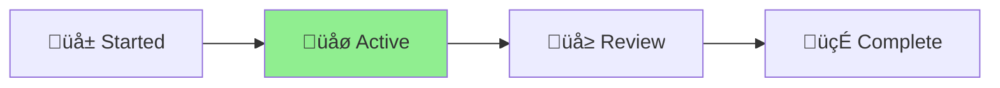

# CLAUDE.md

This file provides guidance to Claude Code (claude.ai/code) when working with code in this
repository.

## Security & Compliance Standards

### OWASP Top 10 Verification Required

Before suggesting or implementing any code changes, verify against current OWASP Top 10:

#### A01 - Broken Access Control

- Validate all authorization checks in CLI commands and file operations
- Implement principle of least privilege for file system access
- Check for direct object references in configuration handling

#### A02 - Cryptographic Failures

- Use strong, up-to-date encryption algorithms for any sensitive data
- Properly manage secrets and API keys (GitHub tokens, etc.)
- Validate SSL/TLS implementations in GitHub API calls

#### A03 - Injection

- Use parameterized operations for all git commands and file system operations
- Validate and sanitize all user inputs from CLI arguments and config files
- Implement proper output encoding for template processing

#### A04 - Insecure Design

- Review architecture for security flaws in release management workflow
- Implement secure design patterns for file handling and git operations
- Consider threat modeling implications for CI/CD integration

#### A05 - Security Misconfiguration

- Check default configurations in `nagare.config.ts`
- Ensure proper error handling (no sensitive data exposure in logs)
- Validate security headers and settings for documentation server

#### A06 - Vulnerable Components

- Audit all Deno dependencies for known vulnerabilities
- Keep libraries and frameworks updated (especially git and GitHub CLI)
- Document component security status in dependency updates

#### A07 - Authentication Failures

- Implement proper GitHub authentication handling
- Use strong authentication mechanisms for GitHub API
- Protect against unauthorized release operations

#### A08 - Software/Data Integrity Failures

- Validate data integrity in version updates and changelog generation
- Use secure update mechanisms for file modifications
- Implement proper CI/CD security for release pipeline

#### A09 - Logging/Monitoring Failures

- Log security-relevant events in release operations
- Implement proper monitoring for unauthorized changes
- Ensure logs don't contain sensitive data (tokens, credentials)

#### A10 - Server-Side Request Forgery (SSRF)

- Validate all external requests to GitHub API
- Implement proper URL validation for template processing
- Use allowlists for external resources in documentation

### ISO 27001 Compliance Notes

- Document all security decisions in commit messages
- Maintain audit trail for all release operations
- Ensure security reviews for all file handler modifications
- Flag any potential compliance issues immediately

### Security Review Process

When reviewing or suggesting code changes:

1. **Security First**: Always perform OWASP Top 10 assessment before any other suggestions
2. **Flag Issues**: Explicitly call out any potential OWASP violations
3. **Suggest Mitigations**: Provide specific remediation steps for identified risks
4. **Document Decisions**: Include security rationale in comments
5. **Compliance Check**: Note any ISO 27001 implications

### Required Security Checks

For every code change, verify:

- Input validation and sanitization (especially CLI args and config files)
- Authentication and authorization (GitHub API access)
- Secure data handling (version info, changelog data)
- Error handling (no information disclosure in error messages)
- Dependency security status (Deno modules)
- Logging of security events (release operations, file modifications)

## Initial Setup

### Enable Git Hooks

To prevent formatting issues in CI, enable the pre-commit hook:

```bash
git config core.hooksPath .githooks
```

This will automatically format code before each commit, preventing formatting failures in CI.

## Development Commands

### Core Development Tasks

```bash
# Testing
deno task test              # Run all tests
deno task test:watch        # Run tests in watch mode with --watch
deno task test:coverage     # Run tests with coverage collection
deno test path/to/test.ts   # Run a single test file

# Code Quality
deno task lint              # Run linter
deno task fmt               # Format code
deno task check             # Type check all TypeScript files
deno task build             # Full validation (check + test + lint + fmt check)

# Dependency Management
deno update                 # Update all dependencies to latest versions
deno update --dry-run       # Preview dependency updates without applying

# Development
deno task dev               # Run with watch mode on examples/test.ts

# Documentation
deno task docs              # Generate HTML documentation
deno task docs:serve        # Serve docs on http://localhost:8080

# Release Management (self-hosting)
deno task nagare            # Run release process
deno task nagare:dry        # Preview release changes
deno task nagare:patch      # Force patch release
deno task nagare:minor      # Force minor release
deno task nagare:major      # Force major release
deno task nagare:rollback   # Rollback a release
```

### Testing Single Files

```bash
deno test --allow-all path/to/file_test.ts
```

## High-Level Architecture

### Core Components and Interactions

1. **Release Flow Architecture**:
   - `cli.ts` → `ReleaseManager` → orchestrates the entire release process
   - `GitOperations` → interfaces with git for commits, tags, and history
   - `VersionUtils` → calculates semantic version bumps from conventional commits
   - `ChangelogGenerator` → creates CHANGELOG.md entries in Keep a Changelog format
   - `FileHandlerManager` → intelligently updates version references in files
   - `TemplateProcessor` → processes Vento templates for custom file formats
   - `GitHubIntegration` → creates GitHub releases via `gh` CLI

2. **Key Design Patterns**:
   - **Manager Pattern**: `-manager` suffix classes orchestrate complex workflows
   - **Operations Pattern**: `-operations` suffix for direct system interfaces
   - **Dependency Injection**: Configuration drives behavior throughout
   - **Fail-Fast Validation**: Early validation with descriptive errors
   - **Type Safety**: Comprehensive TypeScript interfaces in `types.ts`

3. **Configuration System**:
   - `nagare.config.ts` defines project-specific release configuration
   - Built-in file handlers for common patterns (deno.json, package.json, README.md)
   - Custom update functions for complex file modifications
   - Template support via Vento for variable substitution

4. **Conventional Commits Integration**:
   - `feat:` → Minor version bump
   - `fix:` → Patch version bump
   - `BREAKING CHANGE:` or `!` → Major version bump
   - Other types (docs, style, refactor) → Patch version bump

### Important Cross-File Patterns

1. **Version Update Flow**:
   - `ReleaseManager` determines new version
   - `FileHandlerManager` detects file types and applies appropriate handlers
   - Built-in handlers use safe regex patterns with line anchors
   - Custom handlers can be defined in configuration

2. **Template Processing**:
   - `TemplateProcessor` uses Vento engine
   - Templates receive `TemplateData` with version info and metadata
   - Built-in templates: TypeScript, JSON, YAML, Text
   - Custom templates supported via configuration

3. **Rollback Architecture**:
   - `RollbackManager` reverses releases by version or tag
   - Restores previous file states from git history
   - Removes tags and optionally GitHub releases
   - Maintains git history integrity

### Programming Paradigm & Architecture

Nagare follows a **pragmatic hybrid approach** combining object-oriented and functional programming:

1. **Object-Oriented Core**:
   - Use classes for major components (managers, operations, processors)
   - Encapsulate state and behavior within classes
   - Apply dependency injection through constructors
   - Follow the established pattern: components receive `NagareConfig` and create their dependencies

2. **Functional Elements**:
   - Write pure utility functions for validation and transformation
   - Use immutable data structures (`as const` assertions)
   - Leverage functional array methods (map, filter, reduce, some, every)
   - Avoid side effects in utility functions

3. **Consistency Guidelines**:
   - New features should follow the existing class-based architecture
   - Utility functions go in relevant modules or a dedicated utils file
   - Keep business logic in classes, data transformations in pure functions
   - Use TypeScript's type system extensively for compile-time safety

For detailed analysis, see [PROGRAMMING_PARADIGM.md](PROGRAMMING_PARADIGM.md)

### File Organization Convention

The project follows a clear separation of concerns for file placement:

1. **Root Directory** - Entry points and exports only:
   - `cli.ts` - Main CLI entry point
   - `mod.ts` - Library entry point
   - `config.ts` - Configuration loader
   - `nagare.config.ts` - User configuration file
   - `types.ts` - Exported type definitions
   - `version.ts` - Auto-generated version info

2. **`/src` Directory** - Core runtime code (distributed with package):
   - Release management components (`release-manager.ts`, `rollback-manager.ts`)
   - File operations (`file-handlers.ts`, `template-processor.ts`)
   - Git integration (`git-operations.ts`, `github-integration.ts`)
   - All code that runs when users execute nagare

3. **`/scripts` Directory** - Development tools (NOT distributed):
   - Build utilities (`inline-templates.ts`, `publish-to-jsr.ts`)
   - Code generation (`generate-i18n-types.ts`)
   - Documentation tools (`enhance-docs.ts`, `fix-docs-urls.ts`)
   - Analysis scripts (`find-nagare-errors.ts`, `check-patterns.ts`)

4. **`/plans` Directory** - Documentation and design documents:
   - Architecture decisions and proposals
   - Migration guides and upgrade paths
   - Generated explanations and findings
   - Any markdown documentation that isn't user-facing

5. **`/tests` Directory** - Test files:
   - Unit tests for all `/src` components
   - Integration tests for end-to-end scenarios

**Key Principle**: Keep the root clean with only essential entry points. Users interact with root
files, runtime code lives in `/src`, and development tools go in `/scripts`.

### Code Style Requirements

- **Formatting**: 2 spaces, double quotes, semicolons required, 100 char line width
- **File Naming**: Kebab-case with descriptive suffixes (e.g., `release-manager.ts`)
- **Class Naming**: PascalCase with semantic suffixes (e.g., `ReleaseManager`)
- **Strict TypeScript**: All strict checks enabled, no implicit any
- **Comments**: Avoid unless necessary for complex logic

### Critical Development Notes

1. **Security Testing**: When adding features, create corresponding security tests alongside
   functional tests
2. **File Updates**: Always use line-anchored regex patterns to prevent corruption and validate
   inputs
3. **Error Handling**: Provide actionable error messages with suggestions (no sensitive data
   exposure)
4. **Git State**: Many operations require clean git state - validate early and log security events
5. **Self-Hosting**: This project manages its own releases - be careful with version.ts changes
6. **Pre-flight**: Always run `deno fmt`, `deno check **/*.ts`, `deno lint`, `deno test` before
   staging a commit
7. **Attribution**: Don't add "Generated with Claude Code" or "Co-Authored-By: Claude" to commit
   messages or PRs. The fact that CLAUDE.md is present, makes it obvious that Claude is being used
8. **Git Commits**: Use "conventional commits" style to make commit messages, including sufficient
   detail so that a person reading in the future, will be able to understand what the commit was.
   **InfoSec Impact**: Include an InfoSec comment in commit messages when changes have security
   implications. Format: "InfoSec: [brief description of security impact/consideration]" Examples:
   - `feat: add input validation to CLI args\n\nInfoSec: Prevents injection attacks through command line parameters`
   - `fix: update GitHub API token handling\n\nInfoSec: Improves credential security and reduces token exposure risk`
   - `refactor: simplify file processing logic\n\nInfoSec: No security impact - code organization only`
   - `docs: update README installation steps` (no InfoSec comment needed)

### Vento Template Engine Guidelines

Nagare uses Vento for template processing. Critical things to remember:

1. **Filter Syntax**: Use `|>` (F# pipeline), NOT single pipe `|`
   - ✅ Correct: `{{ value |> jsonStringify }}`
   - ❌ Wrong: `{{ value | jsonStringify }}`

2. **Auto-escaping and Security**:
   - Vento auto-escapes by default for security
   - **Context matters for escaping**:
     - **In code generation** (TS/JS/JSON/YAML): Use `|> safe` to output raw values
     - **In HTML contexts**: ALWAYS escape to prevent XSS:
       - ✅ Correct: `<div data="{{ object |> jsonStringify |> escape }}">`
       - ❌ Wrong: `<div data="{{ object |> jsonStringify |> safe }}">`
   - Nagare's built-in templates generate code, not HTML, so `|> safe` is correct
   - If creating custom HTML templates, you MUST escape JSON in attributes

3. **Whitespace Control**: Be careful with trim markers
   - `{{-` removes whitespace before, including newlines
   - `-}}` removes whitespace after
   - Can cause issues like `prerelease:null` instead of `prerelease: null`

4. **Null/Undefined Handling**:
   - Simple conditionals work: `{{ if metadata }}...{{ /if }}`
   - Property access needs care: `metadata.property` throws if metadata is undefined
   - Use explicit null checks in templates

5. **Common Patterns**:
   ```vento
   # For TypeScript/JavaScript code generation:
   {{- if value }}
   {{ value |> jsonStringify |> safe }}
   {{- else }}
   null
   {{- /if }}

   # For HTML attributes (MUST escape for security):
   <div data="{{ object |> jsonStringify |> escape }}">

   # For JSON files:
   "metadata": {{ metadata |> jsonStringify |> safe }}
   ```

See [plans/vento-feedback.md](./plans/vento-feedback.md) for detailed feedback and examples.

9. **Documentation Updates**: After functionality is added, update the markdown documentation
   accordingly
10. **Git Merging**: When merging master changes to an active branch, make sure both branches are
    pulled and up to date first
11. **Security Documentation**: Document all security-related decisions and their rationale for ISO
    27001 compliance
12. **Documentation Location**: Auto-generated API documentation is created in `/docs/api` by deno
    doc. Users can freely add reference documentation, guides, and other manual documentation to the
    `/docs` directory root. This enables GitHub Pages publishing with `/docs` as the source
    directory
13. **JSR Publishing**: A release is only considered successful when it appears on JSR. The JSR
    publish workflow requires GitHub Actions to succeed, which in turn requires a proper release
    with a tag. Always verify JSR publishing succeeded before considering a release complete
14. **Release Automation**: Always use the `--skip-confirmation` flag for non-interactive releases:
    ```bash
    deno task nagare:patch --skip-confirmation  # Non-interactive patch release
    deno task nagare:minor --skip-confirmation  # Non-interactive minor release
    deno task nagare:major --skip-confirmation  # Non-interactive major release
    ```
15. **TypeScript Strictness**: NEVER use `any` type. The project has strict linting that forbids
    `any` types. Always use proper types:
    - Import enums and types: `import { TemplateFormat, BumpType } from "../types.ts"`
    - Use type assertions properly: `"invalid" as BumpType` not `"invalid" as any`
    - This prevents CI failures and ensures type safety
16. **CI Test Considerations**: Some tests may need to be skipped in CI environments. Use:
    ```typescript
    Deno.test({
      ignore: Deno.env.get("CI") === "true",
      name: "Test name",
    }, async (t) => {/* test code */});
    ```
    This is particularly important for tests that require actual git repositories or file system
    operations that may conflict in CI

## Security Scanning Configuration

### DevSkim and CodeQL Integration

The project uses both DevSkim and CodeQL for security scanning. Understanding their suppression
syntax is critical:

1. **DevSkim Suppressions**:
   - Format: `// DevSkim: ignore DS######` where DS###### is the rule ID
   - **MUST be placed inline at the END of the offending line**
   - Common rules:
     - `DS162092` - Hardcoded tokens/keys (use for test SHA values)
     - `DS137138` - Regex patterns (use for intentional unanchored patterns)
     - `DS176209` - TODO comments
     - `DS189424` - eval usage
     - `DS440000` or `DS440011` - SSL/TLS protocol references
   - Example: `const sha = "abc123"; // DevSkim: ignore DS162092`

2. **CodeQL Suppressions**:
   - Format: `// codeql[rule-id]` where rule-id is the CodeQL query ID
   - **MUST be placed on a SEPARATE LINE BEFORE the offending code**
   - Common rules:
     - `js/redos` - Regular expression denial of service
     - `js/regex/missing-regexp-anchor` - Unanchored regex patterns
   - Example:
     ```typescript
     // codeql[js/redos]
     const pattern = /(a+)+b/;
     ```

3. **Directory Exclusions**:
   - DevSkim: Configure in `.github/workflows/devskim.yml` using `ignore-globs`
   - CodeQL: Configure in `.github/codeql/codeql-config.yml` using `paths-ignore`
   - The `/docs/api` directory is auto-generated and should be excluded from both scanners

4. **False Positive Guidelines**:
   - Test data (SHA values, tokens) should use DevSkim suppressions
   - Intentional security test patterns should be suppressed with clear comments
   - Documentation strings mentioning crypto/SSL should be suppressed
   - Always add explanation comments for why a suppression is needed

5. **Important Notes**:
   - Never use the old `// lgtm` syntax - it's deprecated
   - DevSkim comments go inline, CodeQL comments go on the line before
   - Some scanners need workflow restarts to recognize new suppressions
   - Always verify suppressions work before considering alerts resolved

<!-- AICHAKU:START -->

<!-- AICHAKU:METHODOLOGY:START -->

## 🎯 MANDATORY: Aichaku Integration Rules

YOU ARE REQUIRED TO FOLLOW THESE RULES WITHOUT EXCEPTION:

### 1. Discussion-First Document Creation

**Phase 1: DISCUSSION MODE (Default when methodology keywords detected)** ✅ Acknowledge the
methodology context: "🪴 Aichaku: I see you're thinking about [topic]" ✅ Ask clarifying questions
to understand the goal ✅ Help shape and refine the idea ❌ DO NOT create any project folders yet ❌
DO NOT create any documents yet

**Phase 2: WAIT FOR EXPLICIT READINESS** Only create documents when user says:

- "Let's create a project for this"
- "I'm ready to start"
- "Set up the project"
- "Create the documentation"
- Any direct request for project creation

**Phase 3: CREATE NAMED PROJECT (After user signals readiness)** ✅ Confirm name: "🪴 Aichaku: Based
on our discussion, creating project: [descriptive-name]" ✅ Create ALL documents in:
`docs/projects/active/YYYY-MM-DD-{descriptive-name}/` ✅ Create STATUS.md FIRST ✅ Create
methodology-specific documents ✅ Read guides from `~/.claude/methodologies/`

**YOU MUST NEVER:** ❌ Create documents in the project root directory ❌ Create documents in
.claude/user/ (that's for customizations) ❌ Ask where to put files (always use docs/projects/) ❌
Create folders before user is ready to formalize

### 2. CRITICAL: DISCUSSION FIRST, THEN CREATE WITHOUT ASKING

**During Discussion Phase:** ✅ DO say: "🪴 Aichaku: I understand you're exploring [topic]. Let me
help you think through this..." ✅ DO say: "What specific challenges are you looking to address?" ❌
NEVER say: "Would you like me to create documents for this?"

**Once User Signals Readiness:** ❌ NEVER say: "Would you like me to..." ❌ NEVER say: "Shall I
create..." ❌ NEVER say: "Should I go ahead and..." ✅ IMMEDIATELY say: "🪴 Aichaku: Creating
project: [descriptive-name]" ✅ IMMEDIATELY say: "Setting up Shape Up documentation..." ✅
IMMEDIATELY say: "Generating sprint planning templates..."

**THE RULE:** Discuss and refine FIRST. Once user signals readiness, CREATE IMMEDIATELY without
asking. This provides thoughtful structure while respecting user autonomy.

### 3. Methodology Detection & Discussion

When you hear these keywords, ENTER DISCUSSION MODE:

**Planning Keywords** → Will create in `docs/projects/active/*/` (when ready):

- "shape"/"pitch" → Discuss Shape Up approach → Later: pitch.md
- "sprint"/"scrum" → Discuss Scrum planning → Later: sprint-planning.md
- "kanban"/"board" → Discuss Kanban flow → Later: kanban-board.md
- "mvp"/"lean" → Discuss Lean experiments → Later: experiment-plan.md

**Discussion Mode Actions:**

1. Acknowledge: "🪴 Aichaku: I see you're interested in [methodology]"
2. Read the appropriate guide SILENTLY:
   - `~/.claude/methodologies/[methodology]/[METHODOLOGY]-AICHAKU-GUIDE.md`
   - `~/.claude/methodologies/core/[MODE].md`
3. Ask clarifying questions based on the methodology
4. Help refine the approach
5. WAIT for explicit "create project" signal

### 4. Visual Identity & Progress Indicators

**MANDATORY Visual Identity:** ✅ ALWAYS prefix Aichaku messages with: 🪴 Aichaku: ✅ Use growth
phase indicators: 🌱 (new) → 🌿 (active) → 🌳 (mature) → 🍃 (complete) ✅ Show current phase in
status updates with **bold** text and arrow: [Planning] → [**Executing**] → [Complete] ▲

**Example Status Display:**

```
🪴 Aichaku: Shape Up Progress
[Shaping] → [**Betting**] → [Building] → [Cool-down]
              ▲
Week 2/6 ████████░░░░░░░░░░░░ 33% 🌿
```

**Methodology Icons:**

- Shape Up: Use 🎯 for betting, 🔨 for building
- Scrum: Use 🏃 for sprints, 📋 for backlog
- Kanban: Use 📍 for cards, 🌊 for flow
- Lean: Use 🧪 for experiments, 📊 for metrics

**NEVER:** ❌ Use garden metaphors in text (no "planting", "growing", "harvesting") ❌ Mix visual
indicators (keep consistent within a project) ❌ Overuse emojis (maximum one per concept)

### 5. Mermaid Diagram Integration

**MANDATORY Diagram Creation:** ✅ Include Mermaid diagrams in EVERY project documentation ✅ Add
methodology-specific workflow diagrams ✅ Use diagrams to visualize project status

**Required Diagrams by Document:**

**In STATUS.md:**



**In Shape Up pitch.md:**


**In Scrum sprint-planning.md:**


**NEVER:** ❌ Create diagrams without labels ❌ Use complex diagrams when simple ones work ❌ Forget
to update diagrams with status changes

### 6. Project Lifecycle Management

**Starting Work:**

1. ⚠️ **CHECK TODAY'S DATE**: Look for "Today's date:" in the environment info
2. Create: `docs/projects/active/YYYY-MM-DD-{descriptive-name}/`
   - YYYY-MM-DD must be TODAY'S actual date from environment
   - Common mistake: Using 01 instead of current month
   - Example if today is 2025-07-10: `active-2025-07-10-project-name/`
3. Create STATUS.md immediately (with status diagram)
4. Read appropriate methodology guides
5. Create planning documents (with workflow diagrams)
6. WAIT for human approval before coding

**During Work:**

- Update STATUS.md regularly (including diagram state)
- Create supporting documents freely
- Start responses with: "🪴 Aichaku: Currently in [mode] working on [task]"

**Completing Work:**

1. Create YYYY-MM-DD-{Project-Name}-CHANGE-LOG.md summarizing all changes
   - ⚠️ Use TODAY'S date from environment info (not example dates!)
   - Example format: 2025-07-10-Fix-Security-Tests-CHANGE-LOG.md
   - Example format: 2025-07-10-Update-Authentication-CHANGE-LOG.md
   - NEVER just "CHANGE-LOG.md" - always include TODAY'S date and descriptive project name
2. Update final diagram states
3. Rename folder: active-* → done-*
4. Ask: "Work appears complete. Shall I commit and push?"
5. Use conventional commits: feat:/fix:/docs:/refactor:

### 7. Git Automation

When work is confirmed complete:

```bash
git add docs/projects/active/[current-project]/
git commit -m "[type]: [description]

- [what was done]
- [key changes]"
git push origin [current-branch]
```

### 8. Error Recovery

If you accidentally create a file in the wrong location:

1. Move it immediately: `mv [file] docs/projects/active/*/`
2. Update STATUS.md noting the correction
3. Continue without asking

REMEMBER: This is AUTOMATIC behavior. Users expect documents to appear in the right place without
asking.

Methodologies: Shape Up, Scrum, Kanban, Lean, XP, Scrumban Learn more:
https://github.com/RickCogley/aichaku

<!-- AICHAKU:METHODOLOGY:END -->

<!-- AICHAKU:DOC-STANDARDS:START -->

## 📝 Selected Documentation Standards

🪴 Aichaku: Based on your project configuration, follow these documentation standards:

### DIATAXIS-GOOGLE

# Diátaxis + Google Developer Documentation Style Guide

## Quick Reference

The Diátaxis framework organizes documentation into four distinct modes, each serving a specific
user need. Combined with Google's developer documentation style guide, this creates clear,
accessible, and well-structured documentation.

### The Four Modes of Documentation

1. **🎓 Tutorial** - Learning-oriented: Teaching a beginner to do something
2. **🔧 How-to Guide** - Task-oriented: Showing how to solve a specific problem
3. **📖 Reference** - Information-oriented: Describing the machinery
4. **💡 Explanation** - Understanding-oriented: Clarifying and discussing concepts

## Tutorial Guidelines

### Purpose

Tutorials are lessons that take the reader through a series of steps to complete a project. They are
learning-oriented.

### Structure

````markdown
# Getting Started with [Product Name]

In this tutorial, you'll learn how to [main outcome]. By the end, you'll have [specific
achievement].

## Prerequisites

- [Requirement 1]
- [Requirement 2]

## What you'll learn

- How to [task 1]
- How to [task 2]
- How to [task 3]

## Step 1: [Action]

[Clear instruction with context]

```bash
# Example command
example-command --flag value
```
````

**Expected output:**

```
[Show what success looks like]
```

## Step 2: [Next Action]

[Continue pattern...]

## Summary

You've successfully [what they achieved]. You learned how to:

- [Accomplishment 1]
- [Accomplishment 2]

## Next steps

- Try [related tutorial]
- Explore [related concept]

````
### Google Style Notes for Tutorials

- **Use second person**: "You'll create a service" not "We'll create a service"
- **Present tense**: "The command creates a file" not "The command will create a file"
- **Active voice**: "Configure the server" not "The server should be configured"
- **Clear outcomes**: Start with what the user will achieve
- **Concrete examples**: Use realistic, working examples

## How-to Guide Guidelines

### Purpose
How-to guides are recipes that guide the reader through solving a specific problem. They are task-oriented.

### Structure
```markdown
# How to [Specific Task]

This guide shows you how to [specific task]. Use this approach when you need to [use case].

## Before you begin

Ensure you have:
- [Prerequisite 1]
- [Prerequisite 2]

## Solution

### Option 1: [Approach Name]

Use this approach when [specific condition].

1. [First step]
   ```bash
   command --example
````

2. [Second step]
   ```yaml
   configuration:
     key: value
   ```

### Option 2: [Alternative Approach]

Use this approach when [different condition].

[Steps...]

## Verify your configuration

Test your setup:

```bash
test-command
```

## Troubleshooting

**Problem**: [Common issue] **Solution**: [How to fix it]

## Related tasks

- [Related how-to 1]
- [Related how-to 2]

````
### Google Style Notes for How-to Guides

- **Start with the goal**: Lead with what the user wants to accomplish
- **Provide context**: Explain when to use each approach
- **Focus on the task**: Don't explain concepts in detail (link to explanations)
- **Include verification**: Show how to confirm success
- **Add troubleshooting**: Address common problems

## Reference Guidelines

### Purpose
Reference guides are technical descriptions of the machinery and how to operate it. They are information-oriented.

### Structure
```markdown
# [Component Name] Reference

## Overview

[Brief description of what this component does]

## Synopsis
````

command [options] [arguments]

````
## Description

[Detailed explanation of the component's purpose and behavior]

## Options

### `--option-name` {#option-name}

**Type**: `string` | `boolean` | `number`  
**Default**: `value`  
**Environment variable**: `ENV_VAR_NAME`

[Description of what this option does]

**Example**:
```bash
command --option-name=value
````

### `--another-option` {#another-option}

[Continue pattern...]

## Arguments

### `argument-name`

**Required**: Yes | No\
**Type**: `string`\
**Valid values**: `value1`, `value2`, `value3`

[Description]

## Examples

### Basic usage

```bash
command basic-argument
```

### Advanced usage

```bash
command --option1=value --option2 complex-argument
```

## Exit codes

| Code | Description       |
| ---- | ----------------- |
| 0    | Success           |
| 1    | General error     |
| 2    | Invalid arguments |

## See also

- [`related-command`](link) - Brief description
- [Configuration guide](link)

````
### Google Style Notes for References

- **Be complete**: Document every option, parameter, and return value
- **Be accurate**: Keep technical details precise and up-to-date
- **Use consistent formatting**: Follow the same structure throughout
- **Include examples**: Show real usage for every feature
- **Cross-reference**: Link to related references and explanations

## Explanation Guidelines

### Purpose
Explanations are understanding-oriented discussions that clarify and illuminate concepts. They provide context and background.

### Structure
```markdown
# Understanding [Concept]

## Overview

[High-level introduction to the concept and why it matters]

## Background

[Historical context or theoretical foundation]

## How [Concept] works

[Detailed explanation with diagrams if helpful]

```mermaid
graph TD
    A[Input] --> B[Process]
    B --> C[Output]
````

## Design decisions

### Why we chose [approach]

[Reasoning and trade-offs]

**Advantages**:

- [Benefit 1]
- [Benefit 2]

**Trade-offs**:

- [Limitation 1]
- [Limitation 2]

## Common patterns

### Pattern 1: [Name]

[When and how to apply this pattern]

### Pattern 2: [Name]

[Continue...]

## Comparison with alternatives

| Approach      | Pros   | Cons   | Best for   |
| ------------- | ------ | ------ | ---------- |
| Our approach  | [List] | [List] | [Use case] |
| Alternative 1 | [List] | [List] | [Use case] |

## Further reading

- [Academic paper or specification]
- [Related explanation in docs]
- [External resource]

````
### Google Style Notes for Explanations

- **Start with why**: Explain why this concept matters to the reader
- **Use analogies carefully**: Ensure they clarify rather than confuse
- **Acknowledge complexity**: Don't oversimplify; link to details
- **Discuss trade-offs**: Be honest about limitations
- **Provide context**: Help readers understand the bigger picture

## General Google Style Guidelines

### Writing Principles

1. **Write for a global audience**
   - Use simple, clear language
   - Avoid idioms and cultural references
   - Define acronyms on first use

2. **Be conversational but professional**
   - Use contractions (you're, it's)
   - Be friendly but not overly casual
   - Maintain technical accuracy

3. **Focus on the user**
   - Address the reader directly
   - Explain what's in it for them
   - Anticipate their questions

### Formatting Standards

#### Headings
- Use sentence case: "Configure the database" not "Configure The Database"
- Make headings descriptive and action-oriented
- Use heading levels consistently

#### Lists
- Use bulleted lists for unordered items
- Use numbered lists for sequential steps
- Keep list items parallel in structure

#### Code Samples
```language
# Include a comment explaining what the code does
actual --code --here
````

- Test all code samples
- Show both input and output when relevant
- Use consistent placeholder names: `YOUR_PROJECT_ID`, `REGION`

#### Links

- Use descriptive link text: "See the [configuration guide]" not "See [here]"
- Link to the specific section when possible
- Check links regularly for accuracy

### Voice and Tone

#### Do

- ✅ "To create a user, run the following command"
- ✅ "If the build fails, check your configuration"
- ✅ "This feature requires version 2.0 or later"
- ✅ "You can configure multiple options"

#### Don't

- ❌ "We need to create a user" (use "you" not "we")
- ❌ "The build might fail" (be specific about conditions)
- ❌ "This feature requires a recent version" (be precise)
- ❌ "There are multiple options available" (be direct)

### Documentation Categories

Ensure your documentation clearly identifies which mode it belongs to:

- **Tutorial**: Prefix with "Tutorial:" or "Getting started with"
- **How-to**: Start with "How to" or "Guide to"
- **Reference**: Use "Reference" or "API documentation"
- **Explanation**: Use "Understanding", "Architecture", or "Concepts"

## Template Usage

1. Choose the appropriate template based on your documentation goal
2. Follow the structure but adapt to your specific needs
3. Maintain consistency across similar documents
4. Review against both Diátaxis principles and Google style guide

Remember: Good documentation serves the reader's needs at their moment of need. Choose the right
mode for the right purpose.

---

<!-- AICHAKU:DOC-STANDARDS:END -->

### 1. Discussion-First Document Creation

**Phase 1: DISCUSSION MODE (Default when methodology keywords detected)** ✅ Acknowledge the
methodology context: "🪴 Aichaku: I see you're thinking about [topic]" ✅ Ask clarifying questions
to understand the goal ✅ Help shape and refine the idea ❌ DO NOT create any project folders yet ❌
DO NOT create any documents yet

**Phase 2: WAIT FOR EXPLICIT READINESS** Only create documents when user says:

- "Let's create a project for this"
- "I'm ready to start"
- "Set up the project"
- "Create the documentation"
- Any direct request for project creation

**Phase 3: CREATE NAMED PROJECT (After user signals readiness)** ✅ Confirm name: "🪴 Aichaku: Based
on our discussion, creating project: [descriptive-name]" ✅ Create ALL documents in:
`.claude/output/active-YYYY-MM-DD-{descriptive-name}/` ✅ Create STATUS.md FIRST ✅ Create
methodology-specific documents ✅ Read guides from `~/.claude/methodologies/`

**YOU MUST NEVER:** ❌ Create documents in the project root directory ❌ Create documents in
.claude/user/ (that's for customizations) ❌ Ask where to put files (always use .claude/output/) ❌
Create folders before user is ready to formalize

### 2. CRITICAL: DISCUSSION FIRST, THEN CREATE WITHOUT ASKING

**During Discussion Phase:** ✅ DO say: "🪴 Aichaku: I understand you're exploring [topic]. Let me
help you think through this..." ✅ DO say: "What specific challenges are you looking to address?" ❌
NEVER say: "Would you like me to create documents for this?"

**Once User Signals Readiness:** ❌ NEVER say: "Would you like me to..." ❌ NEVER say: "Shall I
create..." ❌ NEVER say: "Should I go ahead and..." ✅ IMMEDIATELY say: "🪴 Aichaku: Creating
project: [descriptive-name]" ✅ IMMEDIATELY say: "Setting up Shape Up documentation..." ✅
IMMEDIATELY say: "Generating sprint planning templates..."

**THE RULE:** Discuss and refine FIRST. Once user signals readiness, CREATE IMMEDIATELY without
asking. This provides thoughtful structure while respecting user autonomy.

### 3. Methodology Detection & Discussion

When you hear these keywords, ENTER DISCUSSION MODE:

**Planning Keywords** → Will create in `.claude/output/active-*/` (when ready):

- "shape"/"pitch" → Discuss Shape Up approach → Later: pitch.md
- "sprint"/"scrum" → Discuss Scrum planning → Later: sprint-planning.md
- "kanban"/"board" → Discuss Kanban flow → Later: kanban-board.md
- "mvp"/"lean" → Discuss Lean experiments → Later: experiment-plan.md

**Discussion Mode Actions:**

1. Acknowledge: "🪴 Aichaku: I see you're interested in [methodology]"
2. Read the appropriate guide SILENTLY:
   - `~/.claude/methodologies/[methodology]/[METHODOLOGY]-AICHAKU-GUIDE.md`
   - `~/.claude/methodologies/core/[MODE].md`
3. Ask clarifying questions based on the methodology
4. Help refine the approach
5. WAIT for explicit "create project" signal

### 4. Visual Identity & Progress Indicators

**MANDATORY Visual Identity:** ✅ ALWAYS prefix Aichaku messages with: 🪴 Aichaku: ✅ Use growth
phase indicators: 🌱 (new) → 🌿 (active) → 🌳 (mature) → 🍃 (complete) ✅ Show current phase in
status updates with **bold** text and arrow: [Planning] → [**Executing**] → [Complete] ▲

**Example Status Display:**

```
🪴 Aichaku: Shape Up Progress
[Shaping] → [**Betting**] → [Building] → [Cool-down]
              ▲
Week 2/6 ████████░░░░░░░░░░░░ 33% 🌿
```

**Methodology Icons:**

- Shape Up: Use 🎯 for betting, 🔨 for building
- Scrum: Use 🏃 for sprints, 📋 for backlog
- Kanban: Use 📍 for cards, 🌊 for flow
- Lean: Use 🧪 for experiments, 📊 for metrics

**NEVER:** ❌ Use garden metaphors in text (no "planting", "growing", "harvesting") ❌ Mix visual
indicators (keep consistent within a project) ❌ Overuse emojis (maximum one per concept)

### 5. Mermaid Diagram Integration

**MANDATORY Diagram Creation:** ✅ Include Mermaid diagrams in EVERY project documentation ✅ Add
methodology-specific workflow diagrams ✅ Use diagrams to visualize project status

**Required Diagrams by Document:**

**In STATUS.md:**


**In Shape Up pitch.md:**


**In Scrum sprint-planning.md:**


**NEVER:** ❌ Create diagrams without labels ❌ Use complex diagrams when simple ones work ❌ Forget
to update diagrams with status changes

### 6. Project Lifecycle Management

**Starting Work:**

1. Create: `.claude/output/active-YYYY-MM-DD-{descriptive-name}/`
2. Create STATUS.md immediately (with status diagram)
3. Read appropriate methodology guides
4. Create planning documents (with workflow diagrams)
5. WAIT for human approval before coding

**During Work:**

- Update STATUS.md regularly (including diagram state)
- Create supporting documents freely
- Start responses with: "🪴 Aichaku: Currently in [mode] working on [task]"

**Completing Work:**

1. Create YYYY-MM-DD-{Project-Name}-CHANGE-LOG.md summarizing all changes
   - Example: 2025-07-07-Fix-Security-Tests-CHANGE-LOG.md
   - Example: 2025-07-07-Update-Authentication-CHANGE-LOG.md
   - NEVER just "CHANGE-LOG.md" - always include date and descriptive project name
2. Update final diagram states
3. Rename folder: active-* → done-*
4. Ask: "Work appears complete. Shall I commit and push?"
5. Use conventional commits: feat:/fix:/docs:/refactor:

### 7. Git Automation

When work is confirmed complete:

```bash
git add .claude/output/[current-project]/
git commit -m "[type]: [description]

- [what was done]
- [key changes]"
git push origin [current-branch]
```

### 8. Error Recovery

If you accidentally create a file in the wrong location:

1. Move it immediately: `mv [file] .claude/output/active-*/`
2. Update STATUS.md noting the correction
3. Continue without asking

REMEMBER: This is AUTOMATIC behavior. Users expect documents to appear in the right place without
asking.

Methodologies: Shape Up, Scrum, Kanban, Lean, XP, Scrumban Learn more:
https://github.com/RickCogley/aichaku

<!-- AICHAKU:END -->


## Directives for Claude Code from Aichaku

This configuration is dynamically assembled from YAML files in your ~/.claude/aichaku installation.

```yaml
aichaku:
  version: 0.35.4
  source: configuration-as-code
behavioral_directives:
  discussion_first:
    name: Discussion-First Document Creation
    description: A three-phase approach to thoughtful project creation
    phases:
      - name: DISCUSSION MODE
        description: Default when methodology keywords detected
        triggers:
          - shape
          - pitch
          - appetite
          - sprint
          - scrum
          - kanban
          - board
          - mvp
          - lean
          - experiment
        actions:
          required:
            - "Acknowledge the methodology context: '\U0001FAB4 Aichaku: I see you're thinking about [topic]'"
            - Ask clarifying questions to understand the goal
            - Help shape and refine the idea
            - Read appropriate guide SILENTLY from ~/.claude/aichaku/methodologies/
          forbidden:
            - DO NOT create any project folders yet
            - DO NOT create any documents yet
            - 'NEVER say: ''Would you like me to create documents for this?'''
      - name: WAIT FOR READINESS
        description: Only create documents when user signals explicit readiness
        triggers:
          - Let's create a project for this
          - I'm ready to start
          - Set up the project
          - Create the documentation
          - Any direct request for project creation
        actions:
          required:
            - Wait for explicit readiness signal from user
          forbidden:
            - Do not create anything before user signals readiness
      - name: CREATE PROJECT
        description: 'After user signals readiness, create immediately without asking'
        actions:
          required:
            - "Confirm name: '\U0001FAB4 Aichaku: Based on our discussion, creating project: [descriptive-name]'"
            - 'Create ALL documents in: docs/projects/active/YYYY-MM-DD-{descriptive-name}/'
            - Create STATUS.md FIRST
            - Create methodology-specific documents
            - Read guides from ~/.claude/aichaku/methodologies/
          forbidden:
            - NEVER create documents in the project root directory
            - NEVER create documents in .claude/user/
            - NEVER ask where to put files
            - NEVER ask for permission after readiness signal
  critical_behavior:
    name: Critical Behavioral Rules
    rules:
      - name: No asking after readiness
        description: 'Once user signals readiness, CREATE IMMEDIATELY without asking'
        examples:
          do:
            - "\U0001FAB4 Aichaku: Creating project: [descriptive-name]"
            - Setting up Shape Up documentation...
            - Generating sprint planning templates...
          dont:
            - Would you like me to...
            - Shall I create...
            - Should I go ahead and...
      - name: Discussion mode responses
        description: 'During discussion phase, focus on understanding and refinement'
        examples:
          do:
            - "\U0001FAB4 Aichaku: I understand you're exploring [topic]. Let me help you think through this..."
            - What specific challenges are you looking to address?
          dont:
            - Would you like me to create documents for this?
  methodology_detection:
    name: Methodology Detection & Discussion
    description: How to respond when methodology keywords are detected
    planning_keywords:
      shape_up:
        triggers:
          - shape
          - pitch
          - appetite
          - betting
          - cool-down
        discussion_approach: Discuss Shape Up approach
        creates: pitch.md
      scrum:
        triggers:
          - sprint
          - scrum
          - backlog
          - velocity
          - standup
        discussion_approach: Discuss Scrum planning
        creates: sprint-planning.md
      kanban:
        triggers:
          - kanban
          - board
          - WIP
          - flow
          - continuous
        discussion_approach: Discuss Kanban flow
        creates: kanban-board.md
      lean:
        triggers:
          - mvp
          - lean
          - experiment
          - validate
          - pivot
        discussion_approach: Discuss Lean experiments
        creates: experiment-plan.md
    discussion_mode_actions:
      - "Acknowledge: '\U0001FAB4 Aichaku: I see you're interested in [methodology]'"
      - Read the appropriate guide SILENTLY
      - Ask clarifying questions based on the methodology
      - Help refine the approach
      - WAIT for explicit 'create project' signal
  error_recovery:
    name: Error Recovery
    description: How to handle mistakes in file placement
    steps:
      - 'Move file immediately: mv [file] docs/projects/active/*/'
      - Update STATUS.md noting the correction
      - Continue without asking
    principle: >-
      This is AUTOMATIC behavior. Users expect documents to appear in the right place without
      asking.
  git_automation:
    name: Git Automation
    description: How to handle git operations when work is complete
    when: Work is confirmed complete
    commands:
      - 'git add docs/projects/active/[current-project]/'
      - 'git commit -m ''[type]: [description]\n\n- [what was done]\n- [key changes]'''
      - 'git push origin [current-branch]'
    commit_types:
      - feat
      - fix
      - docs
      - refactor
visual_identity:
  prefix:
    mandatory: true
    format: "\U0001FAB4 Aichaku:"
    usage: ALWAYS prefix Aichaku messages with this exact format
  growth_phases:
    description: Project lifecycle indicators
    phases:
      new:
        emoji: "\U0001F331"
        description: New project just started
      active:
        emoji: "\U0001F33F"
        description: Actively being worked on
      mature:
        emoji: "\U0001F333"
        description: In review or maturing
      complete:
        emoji: "\U0001F343"
        description: Completed and archived
    usage: Use these indicators to show project phase in status updates
  progress_display:
    format:
      phase_indicator: '[Phase] → [**Current**] → [Next]'
      arrow_position: Place ▲ under current phase
      progress_bar: 'Week X/Y ████████░░░░░░░░░░░░ XX% [emoji]'
    example: "\U0001FAB4 Aichaku: Shape Up Progress\n[Shaping] → [**Betting**] → [Building] → [Cool-down]\n              ▲\nWeek 2/6 ████████░░░░░░░░░░░░ 33% \U0001F33F\n"
file_organization:
  root: docs/projects/
  description: All Aichaku projects live under this directory
  states:
    active:
      path: docs/projects/active/
      description: Currently active projects
      naming: 'active-YYYY-MM-DD-{descriptive-kebab-case-name}'
      example: active-2025-07-15-security-workflow-modernization
    done:
      path: docs/projects/done/
      description: Completed projects
      naming: 'done-YYYY-MM-DD-{descriptive-kebab-case-name}'
      example: done-2025-07-14-consistent-branding
      transition: Rename from active-* to done-* when complete
methodologies:
  scrum:
    name: Scrum
    triggers: []
    best_for: Predictable delivery
    templates:
      sprint_planning: templates/sprint-planning.md
      sprint_retrospective: templates/sprint-retrospective.md
      user_story: templates/user-story.md
    phases: {}
    integration_url: 'aichaku://methodology/scrum/guide'
  lean:
    name: Lean Startup
    triggers: []
    best_for: New products
    templates: {}
    phases: {}
    integration_url: 'aichaku://methodology/lean/guide'
  shape_up:
    key_concepts:
      - 'Fixed time, variable scope'
      - 6-week cycles with 2-week cooldown
      - Betting table for project selection
      - Shaping work before betting
      - No backlogs or sprints
    cycle_length: 6 weeks
    best_for: Complex features
    templates:
      - pitch.md
      - cycle-plan.md
      - execution-plan.md
      - hill-chart.md
      - change-summary.md
  scrumban:
    name: Scrumban
    triggers: []
    best_for: Hybrid teams
    templates:
      planning_trigger: templates/planning-trigger.md
    phases: {}
    integration_url: 'aichaku://methodology/scrumban/guide'
  kanban:
    name: Kanban
    triggers: []
    best_for: Ongoing support
    templates:
      kanban_board: templates/kanban-board.md
      flow_metrics: templates/flow-metrics.md
    phases: {}
    integration_url: 'aichaku://methodology/kanban/guide'
  xp:
    name: Extreme Programming
    triggers: []
    best_for: Code quality
    templates: {}
    phases: {}
    integration_url: 'aichaku://methodology/xp/guide'
  shape-up:
    name: Shape Up
    triggers: []
    best_for: Complex features
    templates:
      pitch: templates/pitch.md
      cycle_plan: templates/cycle-plan.md
      execution_plan: templates/execution-plan.md
      hill_chart: templates/hill-chart.md
      change_summary: templates/change-summary.md
    phases: {}
    integration_url: 'aichaku://methodology/shape-up/guide'
standards:
  owasp-web:
    name: OWASP Top 10 Web Application Security
    category: security
    summary:
      critical: |
        - A01: Broken Access Control - Validate authorization on EVERY request
        - A02: Cryptographic Failures - Use strong encryption, secure key management
        - A03: Injection - Parameterized queries, input validation, output encoding
        - A07: Authentication Failures - Strong auth, proper session management
        - A09: Logging Failures - Log security events WITHOUT sensitive data
      security_headers: 'X-Content-Type-Options, X-Frame-Options, HSTS, CSP'
      input_validation: 'Never trust user input - validate, sanitize, escape'
      error_handling: 'Generic error messages, log details server-side only'
    integration_url: 'aichaku://standard/security/owasp-web'
  nist-csf:
    name: NIST Cybersecurity Framework (CSF 2.0)
    category: security
    summary:
      critical: |
        - Govern: Establish cybersecurity governance and risk management
        - Identify: Understand risks to systems, people, assets, data
        - Protect: Implement safeguards for critical services
        - Detect: Identify occurrence of cybersecurity events
        - Respond: Take action on detected incidents
        - Recover: Restore capabilities after incidents
      risk_based: Focuses on risk management over compliance
      scalable: Applicable to organizations of all sizes
      implementation: Code-based policies and automated controls
    integration_url: 'aichaku://standard/security/nist-csf'
  conventional-commits:
    name: Conventional Commits
    category: development
    summary:
      critical: |
        - Format: <type>[optional scope]: <description>
        - Primary types: feat, fix, docs, style, refactor, test, chore
        - Breaking changes: Use ! or BREAKING CHANGE footer
        - Imperative mood: "add feature" not "added feature"
        - 50 char subject limit, 72 char body line limit
      automation: Enables semantic versioning and changelog generation
      version_bumping: 'fix=patch, feat=minor, breaking=major'
      infosec_comment: 'Use InfoSec: prefix for security implications'
    integration_url: 'aichaku://standard/development/conventional-commits'
  solid:
    name: SOLID Principles
    category: development
    summary:
      critical: |
        - S: Single Responsibility - One reason to change per class
        - O: Open/Closed - Open for extension, closed for modification
        - L: Liskov Substitution - Subtypes must be substitutable
        - I: Interface Segregation - Many specific interfaces > one general
        - D: Dependency Inversion - Depend on abstractions, not concretions
      object_oriented: Core principles for maintainable OOP design
      flexibility: Enables code extension without modification
      testability: Promotes dependency injection and mocking
    integration_url: 'aichaku://standard/development/solid'
  tdd:
    name: Test-Driven Development
    category: development
    summary:
      critical: |
        - Write failing tests FIRST before any implementation
        - Follow Red-Green-Refactor cycle strictly
        - Test behavior, not implementation details
        - One assertion per test for clarity
        - Use dependency injection for testability
      test_structure: AAA (Arrange-Act-Assert) pattern
      naming: Descriptive test names that explain the behavior
      coverage: Aim for 80%+ coverage with meaningful tests
      mocking: 'Mock external dependencies, not internal implementation'
      cycle_discipline: 'Tests must fail initially, minimal implementation to pass, refactor without breaking'
      isolation_requirements: 'Tests run independently, no shared state, any execution order'
      ci_integration: 'All tests pass before merge, coverage reports generated, visible in PRs'
      test_naming_patterns: 'should [behavior] when [condition], returns [result] for [scenario]'
    integration_url: 'aichaku://standard/development/tdd'
  dora:
    name: DORA Metrics
    category: devops
    summary:
      critical: |
        - Deployment Frequency: How often you deploy to production
        - Lead Time for Changes: Time from commit to production
        - Mean Time to Recovery (MTTR): Time to restore service after incident
        - Change Failure Rate: Percentage of deployments causing failures
      performance_levels: 'Elite, High, Medium, Low performance categories'
      correlation: Strong correlation with organizational performance
      automation: Automated measurement through CI/CD and monitoring
    integration_url: 'aichaku://standard/devops/dora'
  clean-arch:
    name: Clean Architecture
    category: architecture
    summary:
      critical: |
        - Dependency Rule: Dependencies point inward toward higher-level policies
        - Four layers: Entities, Use Cases, Interface Adapters, Frameworks/Drivers
        - Business logic independent of frameworks, UI, and databases
        - Testable without external dependencies
        - Enables flexible technology choices
      independence: 'Framework, UI, Database, and External agency independence'
      testability: Business rules testable in isolation
      dependency_direction: Always inward toward business logic
    integration_url: 'aichaku://standard/architecture/clean-arch'
included:
  core: true
  methodologies:
    - scrum
    - lean
    - shape-up
    - scrumban
    - kanban
    - xp
  standards:
    - owasp-web
    - nist-csf
    - conventional-commits
    - solid
    - tdd
    - dora
    - clean-arch
  doc_standards: []
  has_user_customizations: false
```
