# Nagare (流れ) - Deno Release Management

> Nagare means "flow" in Japanese - reflecting the smooth, automated flow from commits to releases.

[](https://jsr.io/@rick/nagare)
[](https://jsr.io/@rick/nagare)
[](https://opensource.org/licenses/MIT)
[](https://nagare.esolia.deno.net/)

A comprehensive, [Deno](https://deno.com/)-native release management library that automates version
bumping, changelog generation, and GitHub releases using
[conventional commits](https://www.conventionalcommits.org/en/v1.0.0/) and
[semantic versioning](https://semver.org/).

## 🚀 Quick Start (for the impatient)

Don't want to read the docs? Just run this:

```bash
# Initialize Nagare in your project
deno run -A jsr:@rick/nagare/cli init

# Add to your deno.json (copy from init output)
{
  "tasks": {
    "nagare": "deno run -A nagare-launcher.ts",
    "nagare:minor": "deno task nagare minor",
    "nagare:patch": "deno task nagare patch"
  }
}

# Create your first release
deno task nagare
```

That's it! Nagare will analyze your conventional commits and create a release automatically. Read on
for details, or jump to [full documentation](docs/).

## What is Nagare?

Nagare (流れ - "flow") provides intelligent release management for Deno projects. Install once, use
everywhere. Rather than forcing you to manage versions manually, Nagare analyzes your git history
and automatically determines the right version bump based on conventional commits - all while
maintaining professional changelogs and GitHub releases.

## 📚 Documentation & Resources

### 🎯 Interactive Release Workflows (with Mermaid Diagrams)

- [**Release Workflow Guide**](https://rickcogley.github.io/nagare/docs/explanation/release-workflow.html) -
  Complete release process with visual flow diagrams
- [**File Update System**](https://rickcogley.github.io/nagare/docs/explanation/file-update-system.html) -
  How intelligent file handlers work
- [**Security Model**](https://rickcogley.github.io/nagare/docs/explanation/security-model.html) -
  Security architecture with threat analysis

### 📖 Complete Documentation

- [**Full Documentation Hub**](docs/) - Comprehensive guides, tutorials, and reference materials
- [**API Documentation**](https://nagare.esolia.deno.net/) - Complete TypeScript API reference
- [**How-to Guides**](docs/how-to/) - Task-specific instructions and workflows
- [**Reference Materials**](docs/reference/) - Technical specifications and configuration options

### 🔗 Quick Links

📦 **[JSR Package](https://jsr.io/@rick/nagare)** | 🐙
**[GitHub Repository](https://github.com/RickCogley/nagare)**

**✨ Key Features:**

- 🚀 **Automated releases** - Smart version bumping based on conventional commits
- 🤖 **Intelligent file handlers** - Automatic updates for deno.json, package.json, README.md
- 📝 **Professional changelogs** - Following Keep a Changelog format
- 🐙 **GitHub integration** - Automatic release creation with release notes
- 🛡️ **Security-first design** - OWASP-compliant with comprehensive input validation
- 🔧 **Highly configurable** - Flexible templates and custom patterns
- 📄 **Template system** - Powerful Vento-based version file generation
- 🔄 **Rollback support** - Safe recovery from failed releases

## Installation Details

### Recommended: Quick Setup

```bash
# Initialize Nagare in your project
deno run -A jsr:@rick/nagare/cli init
```

This single command will:

- Create a `nagare-launcher.ts` file for proper CLI integration
- Generate a minimal `nagare.config.ts` configuration
- Show you which tasks to add to your `deno.json`

### Configuration Example

```typescript
import type { NagareConfig } from "jsr:@rick/nagare/types";

export default {
  project: {
    name: "My App",
    repository: "https://github.com/user/my-app",
    description: "A fantastic Deno application",
  },

  versionFile: {
    path: "./version.ts",
    template: "typescript",
  },

  github: {
    owner: "user",
    repo: "my-app",
    createRelease: true,
  },

  // Automatic file updates - just specify the files!
  updateFiles: [
    { path: "./deno.json" },
    { path: "./package.json" },
    { path: "./README.md" },
    { path: "./jsr.json" },
  ],
} as NagareConfig;
```

## 🌊 Release Flow Architecture

```mermaid
graph TD
    A[Commit with Conventional Format] --> B[Nagare Analyzes Commits]
    B --> C{Determine Version Bump}
    C -->|feat:| D[Minor Version]
    C -->|fix:| E[Patch Version]
    C -->|BREAKING:| F[Major Version]
    
    D --> G[Update Version Files]
    E --> G
    F --> G
    
    G --> H[Generate Changelog]
    H --> I[Create Git Tag]
    I --> J[Push to GitHub]
    J --> K[Create GitHub Release]
    K --> L[🎉 Release Complete]
    
    style A fill:#e1f5fe
    style L fill:#e8f5e8
    style G fill:#fff3e0
    style H fill:#fff3e0
    style K fill:#f3e5f5
```



## How It Works

Nagare uses a **3-phase release system** that ensures reliable, professional releases:

### 🔍 Analysis Phase

When you run `deno task nagare`, Nagare analyzes your git history since the last release, parsing
conventional commits to determine the appropriate version bump.

### 🔧 Build Phase

Nagare updates all configured files using intelligent handlers, generates professional changelogs,
and creates git tags with proper metadata.

### 📤 Publish Phase

Finally, Nagare pushes changes to GitHub and creates releases with detailed release notes, ensuring
your users always know what's new.

## Usage Examples

### Basic Release Management

```bash
# Automatic version bump based on conventional commits
deno task nagare

# Force specific version bumps
deno task nagare patch   # 1.0.0 → 1.0.1
deno task nagare minor   # 1.0.0 → 1.1.0
deno task nagare major   # 1.0.0 → 2.0.0

# Preview changes without making them
deno task nagare --dry-run

# Skip confirmation prompts (for CI)
deno task nagare --skip-confirmation
```

### Programmatic Usage

```typescript
import { ReleaseManager } from "jsr:@rick/nagare";

const config = {
  project: {
    name: "My App",
    repository: "https://github.com/user/my-app",
  },
  versionFile: {
    path: "./version.ts",
    template: "typescript",
  },
};

const releaseManager = new ReleaseManager(config);
const result = await releaseManager.release();

if (result.success) {
  console.log(`🎉 Released version ${result.version}!`);
  console.log(`📦 ${result.commitCount} commits included`);
  console.log(`🔗 ${result.githubReleaseUrl}`);
}
```

## 🤖 Intelligent File Handlers

Nagare includes built-in handlers for common file types, eliminating the need for custom patterns:

**Supported Files:**

- **JSON**: `deno.json`, `package.json`, `jsr.json`
- **TypeScript**: `version.ts`, `constants.ts`
- **Markdown**: `README.md` (updates version badges)
- **YAML**: Configuration files
- **Language-specific**: `Cargo.toml`, `pyproject.toml`

**Simple Configuration:**

```typescript
// ✅ Just specify the file - Nagare handles the rest!
updateFiles: [
  { path: "./deno.json" },
  { path: "./package.json" },
  { path: "./README.md" },
];
```

## 🛡️ Security & Reliability

### Security-First Design

- **🔒 OWASP-compliant** with comprehensive input validation
- **🛡️ Template sandboxing** prevents code injection
- **✅ Safe file updates** using line-anchored regex patterns
- **📝 Security audit logging** for compliance

### Reliability Features

- **🔄 Atomic operations** with backup and rollback
- **⚡ Pre-flight checks** validate environment before release
- **🎯 Breaking change detection** prevents accidental major releases
- **📊 Comprehensive error handling** with actionable messages

## 🌐 Language Support

Nagare supports both English and Japanese interfaces:

```bash
# Use Japanese interface
deno task nagare --lang ja

# Set environment variable
export NAGARE_LANG=ja
deno task nagare
```

## 📋 Requirements

- **Deno** 2.4+ (uses text imports feature)
- **Git** repository with conventional commits
- **GitHub CLI** (`gh`) for GitHub releases (optional)

## Architecture

### Core Components


### Template System

Nagare uses a powerful template system for version files:

```typescript
// TypeScript template (default)
export const VERSION = "{{version}}";
export const BUILD_INFO = {
  buildDate: "{{buildDate}}",
  gitCommit: "{{gitCommit}}",
};

// Custom template example
template: 'custom',
customTemplate: `
export const APP_VERSION = "{{version}}";
export const FEATURES = {{metadata.features}};
export const CHANGELOG = {{releaseNotes}};
`
```

## 🤝 Community & Support

### Getting Help

- **[GitHub Issues](https://github.com/RickCogley/nagare/issues)** - Bug reports and feature
  requests
- **[GitHub Discussions](https://github.com/RickCogley/nagare/discussions)** - Questions and
  community support
- **[JSR Package](https://jsr.io/@rick/nagare)** - Package documentation

### Contributing

- **[Contributing Guide](CONTRIBUTING.md)** - How to contribute to Nagare
- **[Code of Conduct](CODE_OF_CONDUCT.md)** - Community guidelines
- **[Security Policy](SECURITY.md)** - Responsible disclosure process

## Additional Resources

### Project Documentation

- **[API Documentation](https://nagare.esolia.deno.net/)** - Auto-generated API reference
- **[Full Documentation](docs/)** - Comprehensive guides and tutorials
- **[Project Management](docs/projects/)** - Development methodology documentation

### External Resources

- **[Conventional Commits](https://www.conventionalcommits.org/)** - Commit message format
- **[Keep a Changelog](https://keepachangelog.com/)** - Changelog format
- **[Semantic Versioning](https://semver.org/)** - Version numbering specification
- **[Deno Documentation](https://docs.deno.com/)** - Deno runtime documentation

## License

Nagare is released under the [MIT License](LICENSE).

## 🙏 Acknowledgments

Nagare was extracted and generalized from the [Salty](https://github.com/esolia/salty.esolia.pro)
project's sophisticated release automation system. Special thanks to the Deno team for creating an
excellent TypeScript runtime.

---

**Made with ❤️ by eSolia for the Deno community**
