# Getting Started with Nagare Documentation

Welcome to the Nagare documentation! This guide uses the Diátaxis framework to help you find exactly what you need.

## Prerequisites

Before you start using Nagare:

- **Deno 2.4+** - You need [Deno](https://deno.com/) installed for the runtime
- **Git repository** - A project with git initialized and conventional commits
- **GitHub CLI** (optional) - For automatic GitHub release creation
- **Text editor** - Any editor that supports TypeScript/JavaScript

## 🆕 Latest Updates

**v1.10.0+ - Enhanced Documentation & Branding**

- **📚 COMPREHENSIVE**: **Complete Diátaxis documentation** - Structured learning paths for all skill levels
- **🎨 CONSISTENT**: **Unified branding system** - All CLI output uses consistent `🌊 Nagare:` messaging
- **📊 VISUAL**: **Mermaid diagrams** - Interactive flow charts and architecture diagrams
- **🔗 INTEGRATED**: **GitHub Pages ready** - Professional documentation hosted at rickcogley.GitHub.io/nagare
- **🛡️ SECURITY**: **OWASP-compliant architecture** - Comprehensive security model documentation
- **🤖 INTELLIGENT**: **Smart file handlers** - Automatic updates for common file types
- **🌊 FLOW-FOCUSED**: **Release workflow visualization** - Clear understanding of the release process

**The Documentation Revolution:** This release establishes enterprise-grade documentation with visual diagrams, structured learning paths, and comprehensive coverage of all Nagare features - from quick start to advanced security considerations.

## 📚 Documentation Types

### 🎓 [Tutorials](tutorials/)

**Learning-oriented** - Start here if you're new to Nagare

- [Getting Started](tutorials/getting-started.md) - Complete setup and your first release
- [Advanced Configuration](tutorials/advanced-configuration.md) - Custom templates and file handlers
- [CI/CD Integration](tutorials/ci-cd-integration.md) - Automated releases in GitHub Actions

### 🔧 [How-to Guides](how-to/)

**Task-oriented** - Practical guides for specific tasks

- [**Configure File Updates**](how-to/configure-file-updates.md) - Set up automatic version updates across multiple files
- [**Use Custom Templates**](how-to/use-custom-templates.md) - Create custom version file templates
- [**Set Up CI/CD Integration**](how-to/setup-ci-cd.md) - Integrate with GitHub Actions, GitLab CI, and more
- [**Use Hooks**](how-to/use-hooks.md) - Customize release workflows with lifecycle hooks
- [**Rollback Releases**](how-to/rollback-releases.md) - Safely rollback failed or incorrect releases

### 📖 [Reference](reference/)

**Information-oriented** - Complete technical reference

- [**CLI Reference**](reference/cli.md) - Command-line interface documentation
- [**Configuration Reference**](reference/configuration.md) - Complete configuration options
- [**Template Reference**](reference/templates.md) - Template system and built-in templates
- [**Environment Variables**](reference/environment-variables.md) - All environment variables and their effects
- [**API Documentation**](https://nagare.esolia.deno.net/) - Complete TypeScript API reference

### 💡 [Explanation](explanation/)

**Understanding-oriented** - Deep dives into concepts and design decisions

- [**Architecture Overview**](explanation/architecture.md) - System architecture and design
- [**Design Principles**](explanation/design-principles.md) - Core design philosophy and decisions
- [**Security Model**](explanation/security-model.md) - Comprehensive security architecture
- [**Branding System**](explanation/branding-system.md) - Consistent CLI messaging and brand identity
- [**File Update System**](explanation/file-update-system.md) - How intelligent file handlers work
- [**Release Workflow**](explanation/release-workflow.md) - How releases work internally
- [**Version Management**](explanation/version-management.md) - Semantic versioning implementation

### 📊 Visual Diagrams & Architecture

For the best experience viewing interactive Mermaid diagrams, visit these pages directly on GitHub:

- [**🏗️ Architecture Overview**](https://github.com/RickCogley/nagare/blob/main/docs/explanation/architecture.md) - Complete system architecture with component diagrams
- [**🔄 Release Workflow**](https://github.com/RickCogley/nagare/blob/main/docs/explanation/release-workflow.md) - Visual release process flow with decision trees
- [**🔒 Security Model**](https://github.com/RickCogley/nagare/blob/main/docs/explanation/security-model.md) - Security layers and threat analysis diagrams
- [**📁 File Update System**](https://github.com/RickCogley/nagare/blob/main/docs/explanation/file-update-system.md) - File handler architecture and flow diagrams

## 🚀 Where to Start?

### New to Nagare?

1. Start with [Getting Started](tutorials/getting-started.md)
2. Follow the [Quick Start](#quick-start) section below
3. Read [Architecture Overview](explanation/architecture.md)

### Need to accomplish something specific?

- Browse [How-to Guides](how-to/) for your task
- Check [Reference](reference/) for detailed information
- Review [Configuration Reference](reference/configuration.md) for all options

### Want to understand Nagare deeply?

- Read [Design Principles](explanation/design-principles.md)
- Study [Architecture Overview](explanation/architecture.md)
- Explore [Security Model](explanation/security-model.md)

## 🚀 Quick Start

Don't want to read the full tutorial? Here's the fastest path to your first release:

```bash
# 1. Initialize Nagare in your project
deno run -A jsr:@rick/nagare/cli init

# 2. Add tasks to your deno.json (copy from init output)
{
  "tasks": {
    "nagare": "deno run -A nagare-launcher.ts",
    "nagare:patch": "deno task nagare patch",
    "nagare:minor": "deno task nagare minor",
    "nagare:major": "deno task nagare major",
    "nagare:dry": "deno task nagare --dry-run"
  }
}

# 3. Create your first release
deno task nagare:dry    # Preview changes first
deno task nagare       # Create actual release
```

That's it! Your project now has automated release management.

## 🌊 Release Flow Visualization

```mermaid
graph TD
    A[📝 Commit with Conventional Format] --> B[🔍 Nagare Analyzes Commits]
    B --> C{🎯 Determine Version Bump}
    C -->|feat:| D[📈 Minor Version]
    C -->|fix:| E[🔧 Patch Version]
    C -->|BREAKING:| F[💥 Major Version]
    
    D --> G[📄 Update Version Files]
    E --> G
    F --> G
    
    G --> H[📝 Generate Changelog]
    H --> I[🏷️ Create Git Tag]
    I --> J[📤 Push to GitHub]
    J --> K[🎉 Create GitHub Release]
    K --> L[✅ Release Complete]
    
    style A fill:#e1f5fe
    style B fill:#e3f2fd
    style C fill:#e8eaf6
    style L fill:#e8f5e8
    style G fill:#fff3e0
    style H fill:#fff3e0
    style K fill:#f3e5f5
```



## 📋 Quick Links

### Most Common Tasks

- [Initialize Nagare](tutorials/getting-started.md#step-1-install-nagare)
- [Configure file updates](how-to/configure-file-updates.md)
- [Set up GitHub releases](how-to/setup-ci-cd.md#github-releases)
- [Create custom templates](how-to/use-custom-templates.md)
- [Rollback a release](how-to/rollback-releases.md)

### Essential Reference

- [**All CLI commands**](reference/cli.md)
- [**Configuration options**](reference/configuration.md)
- [**Template system**](reference/templates.md)
- [**Environment variables**](reference/environment-variables.md)
- [**API documentation**](https://nagare.esolia.deno.net/)

### Key Concepts

- [**Release workflow**](explanation/release-workflow.md) - How releases work internally
- [**File update system**](explanation/file-update-system.md) - Intelligent file handlers
- [**Security model**](explanation/security-model.md) - OWASP-compliant architecture
- [**Version management**](explanation/version-management.md) - Semantic versioning

## 🎯 Finding What You Need

### By User Type

**Solo Developer**

- [Getting Started](tutorials/getting-started.md)
- [Configure File Updates](how-to/configure-file-updates.md)
- [Architecture Overview](explanation/architecture.md)

**Team Lead**

- [CI/CD Integration](tutorials/ci-cd-integration.md)
- [Set Up CI/CD](how-to/setup-ci-cd.md)
- [Use Hooks](how-to/use-hooks.md)
- [Design Principles](explanation/design-principles.md)

**Enterprise User**

- [Security Model](explanation/security-model.md)
- [Configuration Reference](reference/configuration.md)
- [Architecture Overview](explanation/architecture.md)

### By Task

**Setting Up Nagare**

- [Getting Started Tutorial](tutorials/getting-started.md)
- [CLI Reference](reference/cli.md)
- [Configuration Reference](reference/configuration.md)

**Customizing Releases**

- [Configure File Updates](how-to/configure-file-updates.md)
- [Use Custom Templates](how-to/use-custom-templates.md)
- [Template Reference](reference/templates.md)

**Automation & CI/CD**

- [Set Up CI/CD Integration](how-to/setup-ci-cd.md)
- [Use Hooks](how-to/use-hooks.md)
- [Environment Variables](reference/environment-variables.md)

**Troubleshooting**

- [Rollback Releases](how-to/rollback-releases.md)
- [Security Model](explanation/security-model.md)
- [CLI Reference](reference/cli.md)

## 🔧 Key Features Overview

### 🚀 Automated Releases

- **Smart version bumping** based on conventional commits
- **Professional changelogs** following Keep a Changelog format
- **GitHub integration** with automatic release creation

### 🤖 Intelligent File Updates

- **Built-in handlers** for common file types (JSON, TypeScript, Markdown)
- **Custom patterns** for special requirements
- **Template system** using Vento for complex version files

### 🛡️ Security & Reliability

- **OWASP-compliant** architecture with comprehensive input validation
- **Atomic operations** with backup and rollback capabilities
- **Security audit logging** for compliance requirements

### ⚙️ Highly Configurable

- **Convention over configuration** with sensible defaults
- **Extensible hooks** for custom workflows
- **Full TypeScript support** with comprehensive type definitions

## 📝 Documentation Principles

This documentation follows these principles:

1. **User-focused language** - We address you directly with clear, actionable guidance
2. **Present tense** - We describe what happens now, not what will happen
3. **Examples first** - We show working examples before explaining concepts
4. **Task-oriented structure** - We organize content around what you want to accomplish
5. **Progressive disclosure** - We start simple and add complexity as needed

## 🤝 Contributing

Found an issue or want to improve the docs?

- File an issue on [GitHub](https://github.com/RickCogley/nagare/issues)
- Read our [Contributing Guide](../CONTRIBUTING.md)
- Submit a pull request with improvements

## 📄 License

Nagare is MIT licensed. See [LICENSE](../LICENSE) for details.

---

**Made with ❤️ by eSolia for the Deno community**
