# Understanding Nagare's Release Workflow

## Overview

The release workflow is the heart of Nagare - it orchestrates the entire process of creating a new version of your software. Understanding this workflow helps you customize Nagare for your specific needs, troubleshoot issues, and contribute to the project effectively.

## Why Release Automation Matters

Manual releases are error-prone and time-consuming. Common issues include:
- Forgetting to update version numbers in multiple files
- Inconsistent changelog entries
- Missing git tags or GitHub releases
- Human errors in repetitive tasks

Nagare automates these steps while maintaining flexibility for project-specific needs.

## How the Release Workflow Works

The release process follows a carefully orchestrated sequence:

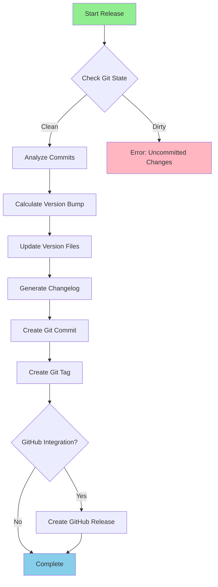

### Detailed Phase Breakdown

#### 1. Pre-flight Checks

Before any modifications, Nagare validates the environment:

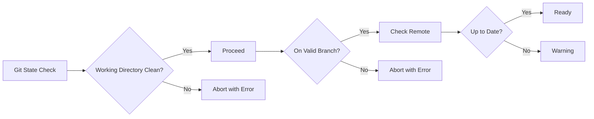

**Design Decision**: We require a clean git state to ensure releases are reproducible and don't accidentally include unintended changes.

#### 2. Version Calculation

Nagare analyzes commit messages since the last release:

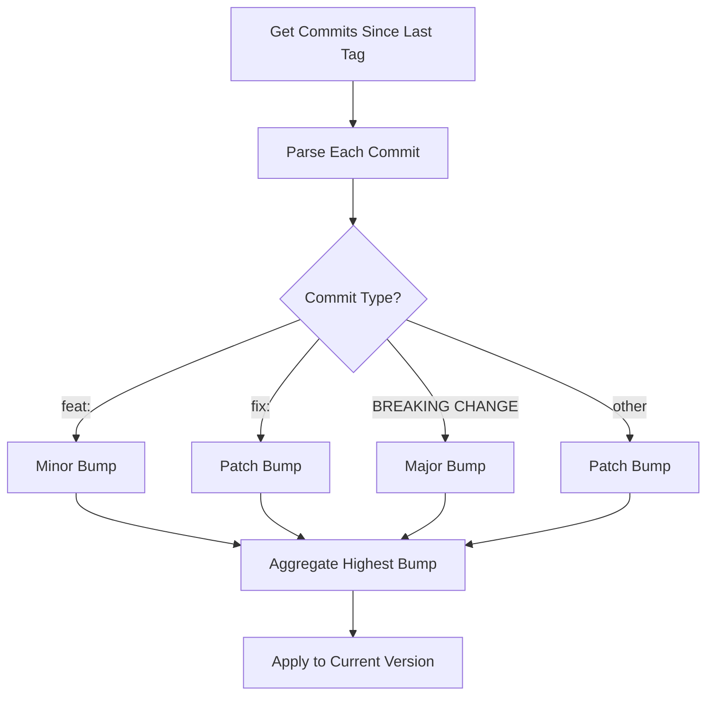

**Trade-offs**:
- **Advantages**: Automatic versioning based on commit history, follows semantic versioning
- **Limitations**: Requires disciplined commit messages, can't override version calculation without force flags

#### 3. File Update Process

The FileHandlerManager orchestrates updates across multiple file types:

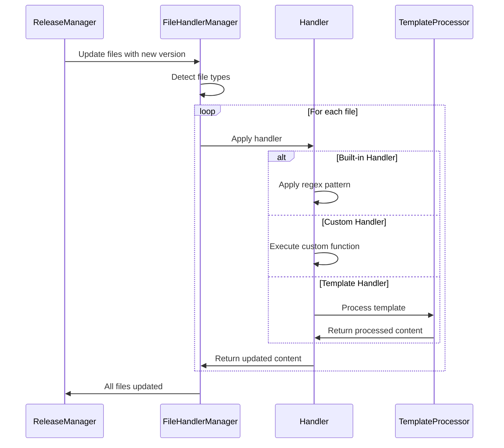

#### 4. Changelog Generation

The changelog follows the Keep a Changelog format:

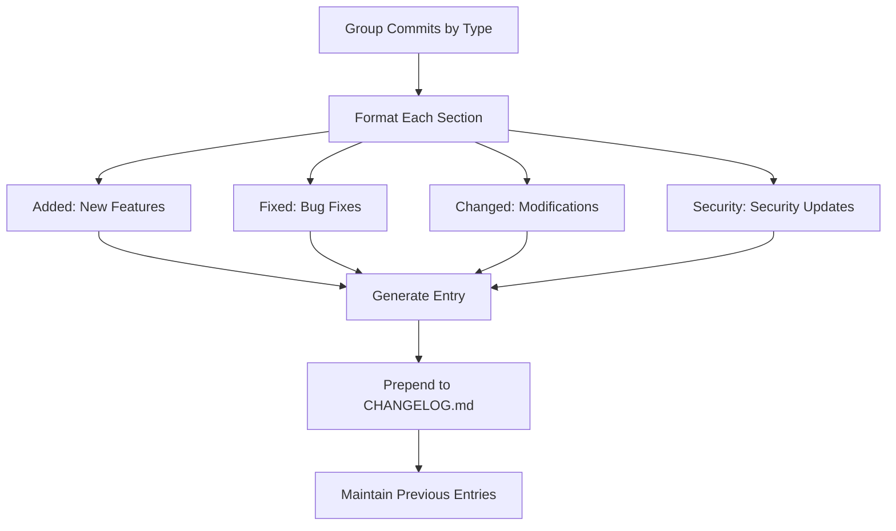

## Design Decisions

### Why Conventional Commits?

We chose conventional commits as the foundation because:

**Advantages**:
- Machine-readable format enables automation
- Industry standard with wide tooling support
- Clear intent in commit history
- Enables automatic version calculation

**Trade-offs**:
- Requires team discipline
- Learning curve for new contributors
- Less flexible than manual versioning

### Why Multiple File Handlers?

Different projects use different file formats for version management:

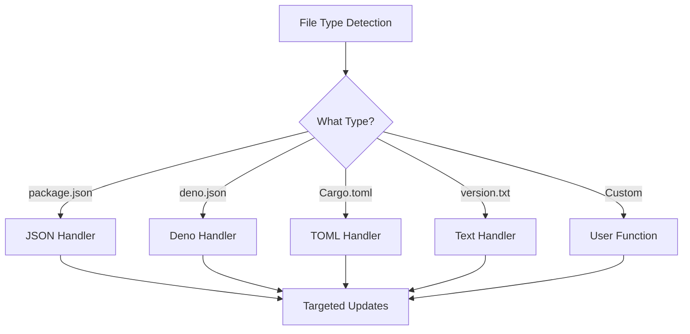

**Design Rationale**: 
- Built-in handlers cover 80% of use cases
- Custom handlers provide escape hatch for complex scenarios
- Template support enables any file format

### Git Integration Architecture

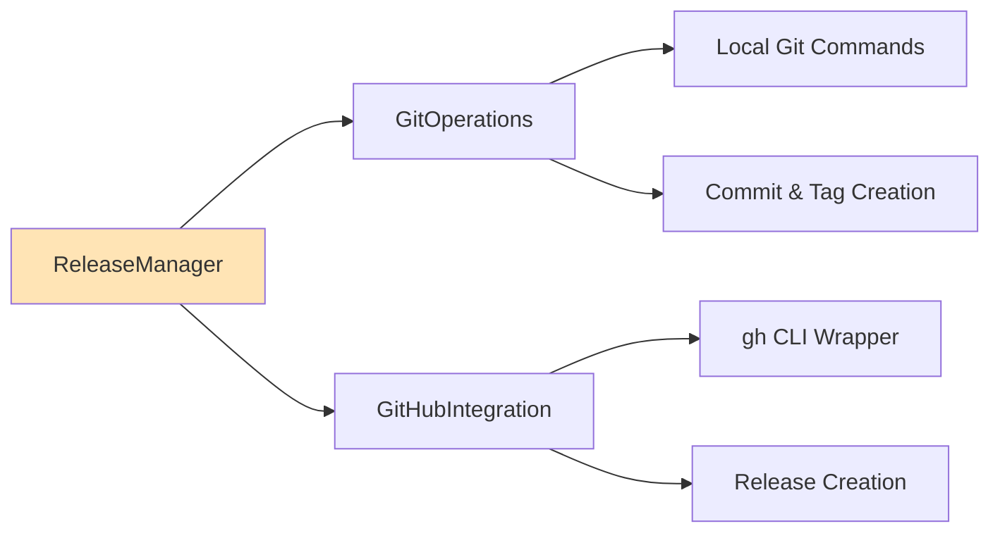

**Why gh CLI?**: 
- Avoids API token management complexity
- Leverages existing GitHub authentication
- Simpler than direct API integration

## Common Patterns

### Pattern 1: Multi-File Version Updates

Many projects need version updates in multiple locations:

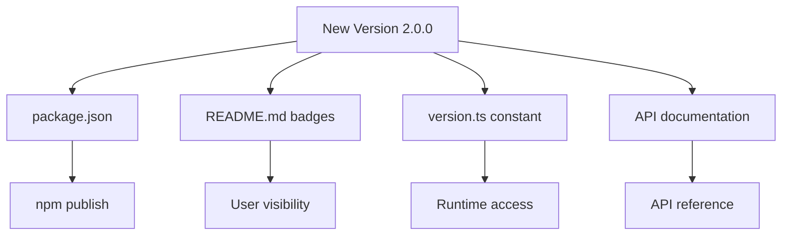

### Pattern 2: Custom Version Locations

For non-standard files, use custom handlers:

```typescript
{
  fileUpdates: {
    customFiles: [{
      path: "src/constants.py",
      update: (content, { newVersion }) => {
        return content.replace(
          /VERSION = ["'][\d.]+["']/,
          `VERSION = "${newVersion}"`
        );
      }
    }]
  }
}
```

### Pattern 3: Template-Based Updates

For complex files, use Vento templates:

```typescript
{
  fileUpdates: {
    templateFiles: [{
      path: "src/build-info.ts",
      templatePath: "./templates/build-info.vento"
    }]
  }
}
```

## Workflow Customization Points

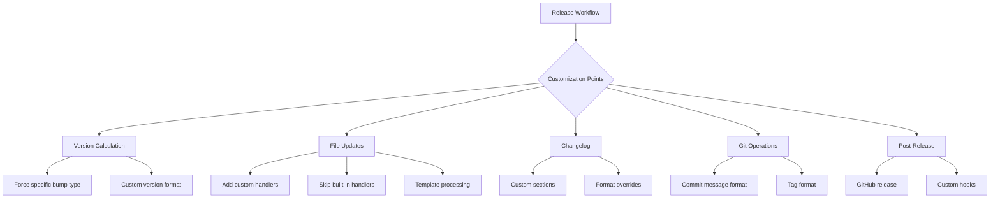

## Error Handling Philosophy

Nagare follows a fail-fast approach with helpful error messages:

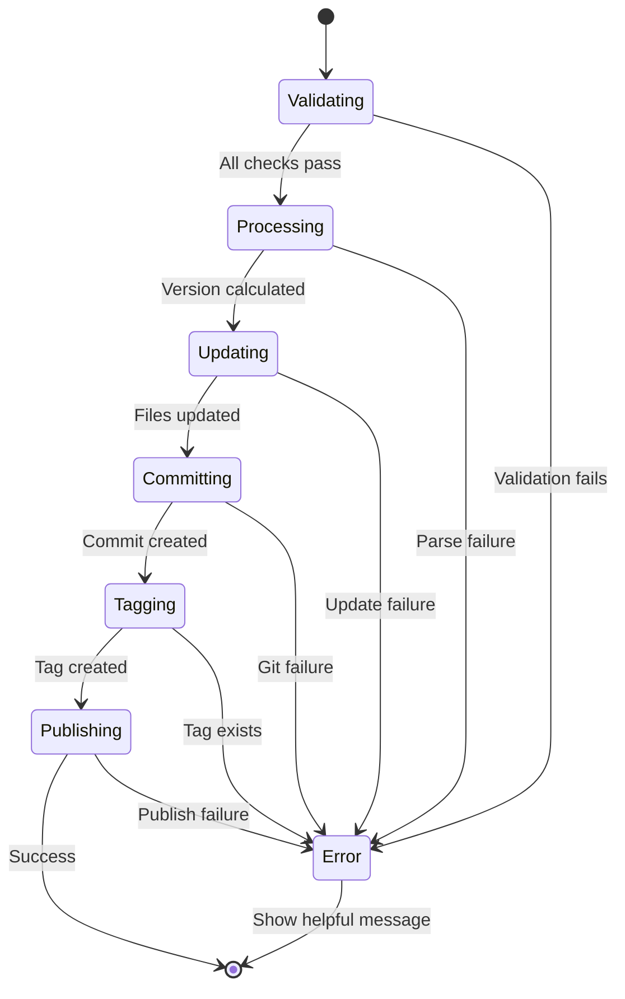

## Comparison with Alternatives

| Tool | Approach | Pros | Cons | Best For |
|------|----------|------|------|----------|
| Nagare | Conventional commits + config | Flexible, type-safe, multi-format | Requires commit discipline | Projects needing customization |
| semantic-release | Fully automated | Zero config, plugin ecosystem | Less flexible, Node.js only | Standard Node.js projects |
| release-it | Interactive/automated | Good defaults, extensible | Requires Node.js | JavaScript ecosystem |
| goreleaser | Config-driven | Go-specific features | Go only | Go projects |

## Security Considerations

The release workflow has several security touchpoints:

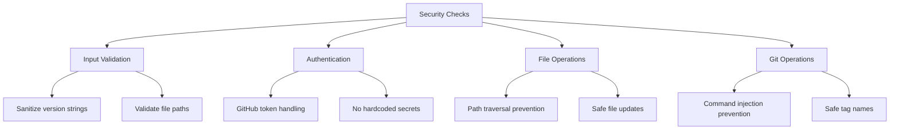

## Further Reading

- [Semantic Versioning Specification](https://semver.org/)
- [Conventional Commits Specification](https://www.conventionalcommits.org/)
- [Keep a Changelog](https://keepachangelog.com/)
- [Architecture Overview](./concepts-architecture.md)
- [Version Management Concepts](./concepts-version-management.md)