# Understanding Version Management in Nagare

## Overview

Version management is fundamental to software development - it communicates changes, maintains compatibility, and enables dependency management. Nagare combines semantic versioning with conventional commits to create an automated, consistent versioning system that scales from simple scripts to complex multi-package projects.

## Why Semantic Versioning Matters

Semantic versioning (SemVer) provides a universal language for software changes:

- **MAJOR.MINOR.PATCH** format (e.g., 2.4.1)
- Each number conveys specific meaning about compatibility
- Enables automated dependency resolution
- Creates trust between maintainers and users

Without semantic versioning:
- Users don't know if updates will break their code
- Dependency managers can't resolve versions safely
- Change impact is unclear from version numbers alone

## How Nagare Implements Semantic Versioning

### Version Calculation Flow

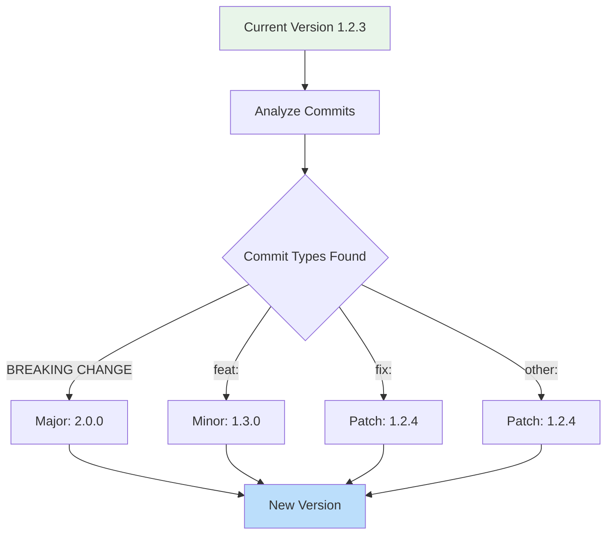

### Conventional Commits Integration

Nagare reads your git history to determine version bumps:

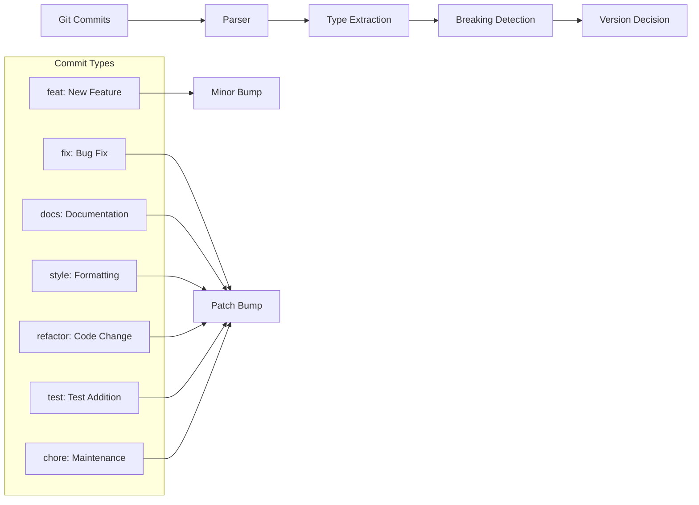

### Breaking Change Detection

Multiple ways to indicate breaking changes:

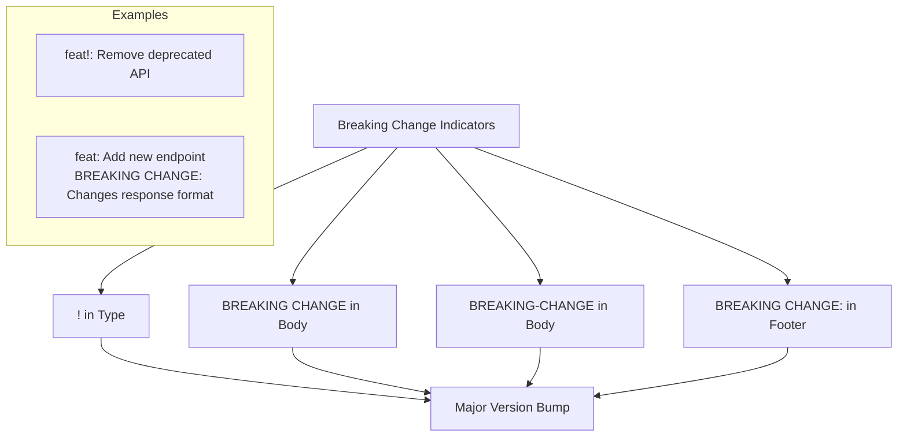

## Design Decisions

### Why Conventional Commits?

We chose conventional commits as the foundation for version management:

**Advantages**:
- Automatic version calculation from commit history
- Self-documenting git log
- Standardized format with tooling ecosystem
- Clear communication of change intent

**Trade-offs**:
- Requires team discipline and training
- Mistakes in commit messages affect versioning
- Retroactive fixes require git history rewriting

### Version Bump Priority System

When multiple commit types exist, Nagare uses the highest priority:

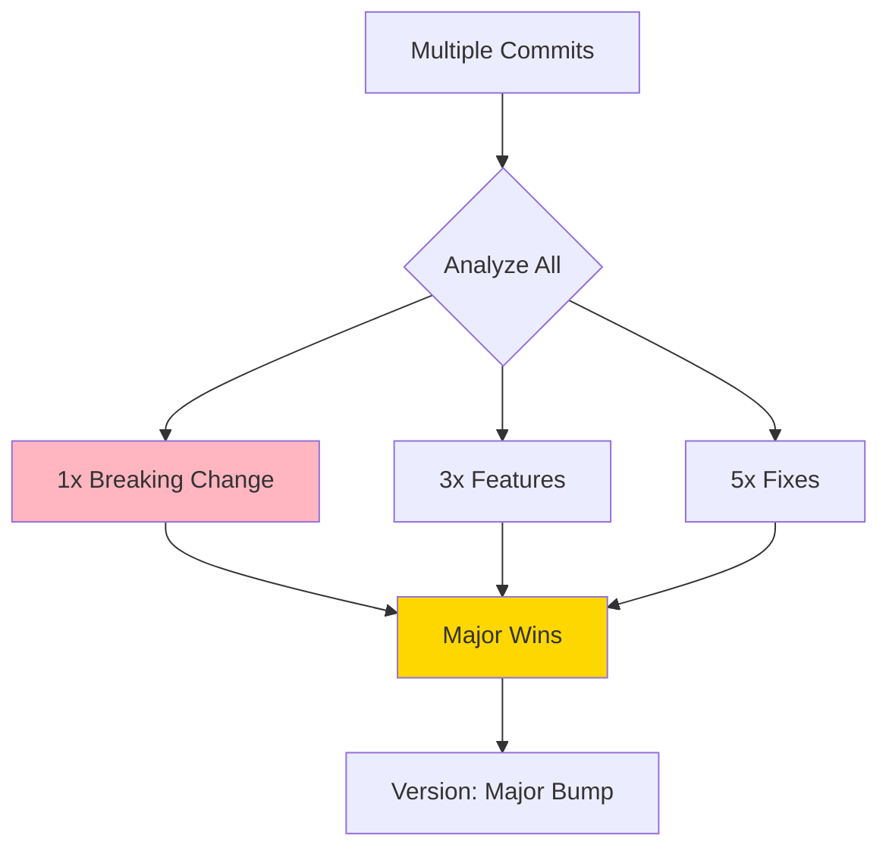

**Design Rationale**: This ensures version numbers always reflect the most significant change, preventing accidental breaking releases with minor version bumps.

### Pre-release Version Handling

Nagare supports pre-release versions for testing:

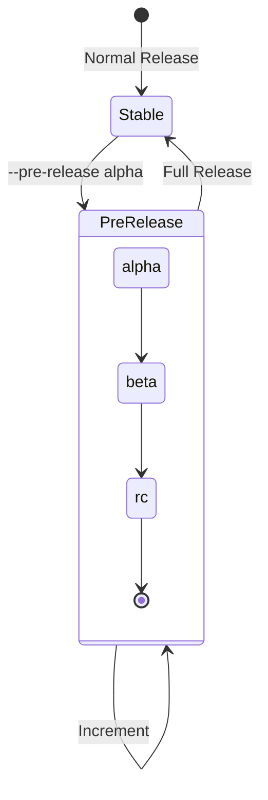

Example progression:
- 1.2.3 → 1.3.0-alpha.0
- 1.3.0-alpha.0 → 1.3.0-alpha.1
- 1.3.0-alpha.1 → 1.3.0-beta.0
- 1.3.0-beta.0 → 1.3.0-rc.0
- 1.3.0-rc.0 → 1.3.0

## Version Storage Patterns

### Multi-File Synchronization

Nagare keeps versions synchronized across multiple files:

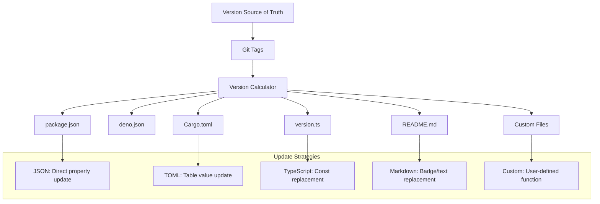

### Built-in File Handlers

Each file type has specific update patterns:

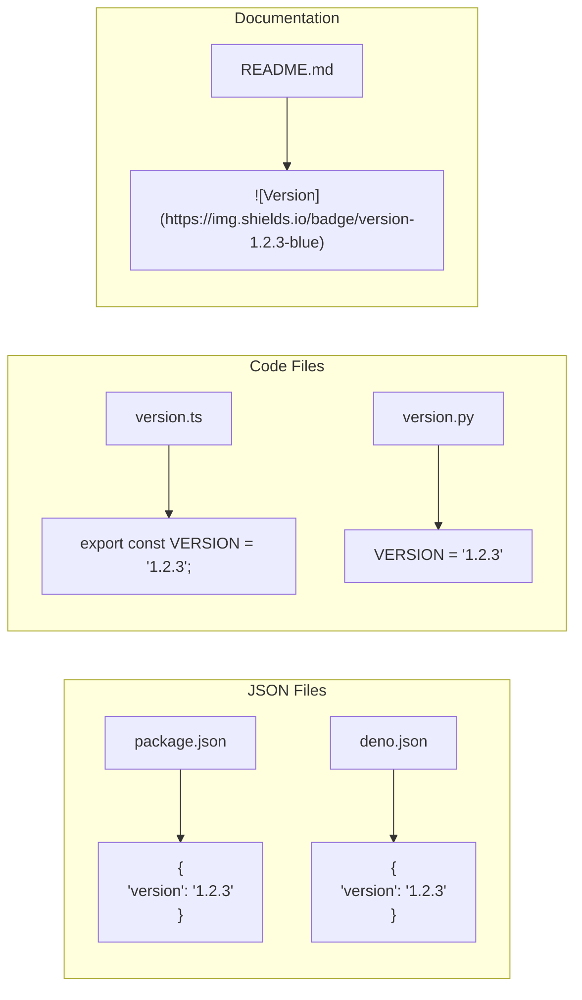

## Common Patterns

### Pattern 1: Monorepo Version Management

For monorepos with multiple packages:

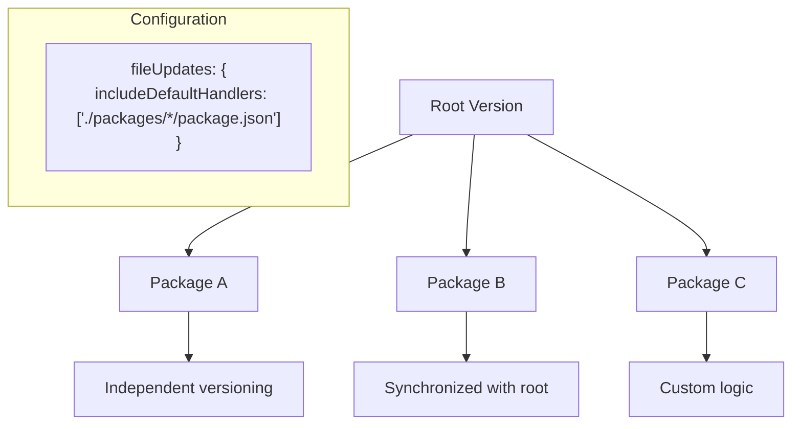

### Pattern 2: Version Constants in Code

Embedding version in source code:

```typescript
// Template approach
{
  fileUpdates: {
    templateFiles: [{
      path: "src/version.ts",
      template: `export const VERSION = "&#123;&#123; version &#125;&#125;";
export const BUILD_DATE = "&#123;&#123; now |> date &#125;&#125;";
export const COMMIT = "&#123;&#123; gitCommit &#125;&#125;";`
    }]
  }
}
```

### Pattern 3: Documentation Badge Updates

Keeping README badges current:

```typescript
{
  fileUpdates: {
    customFiles: [{
      path: "README.md",
      update: (content, { newVersion }) => {
        // Update version badge
        content = content.replace(
          /shields\.io\/badge\/version-[\d.]+/g,
          `shields.io/badge/version-${newVersion}`
        );
        // Update installation instructions
        content = content.replace(
          /@[\d.]+/g,
          `@${newVersion}`
        );
        return content;
      }
    }]
  }
}
```

## Version Validation and Safety

### Pre-flight Validation

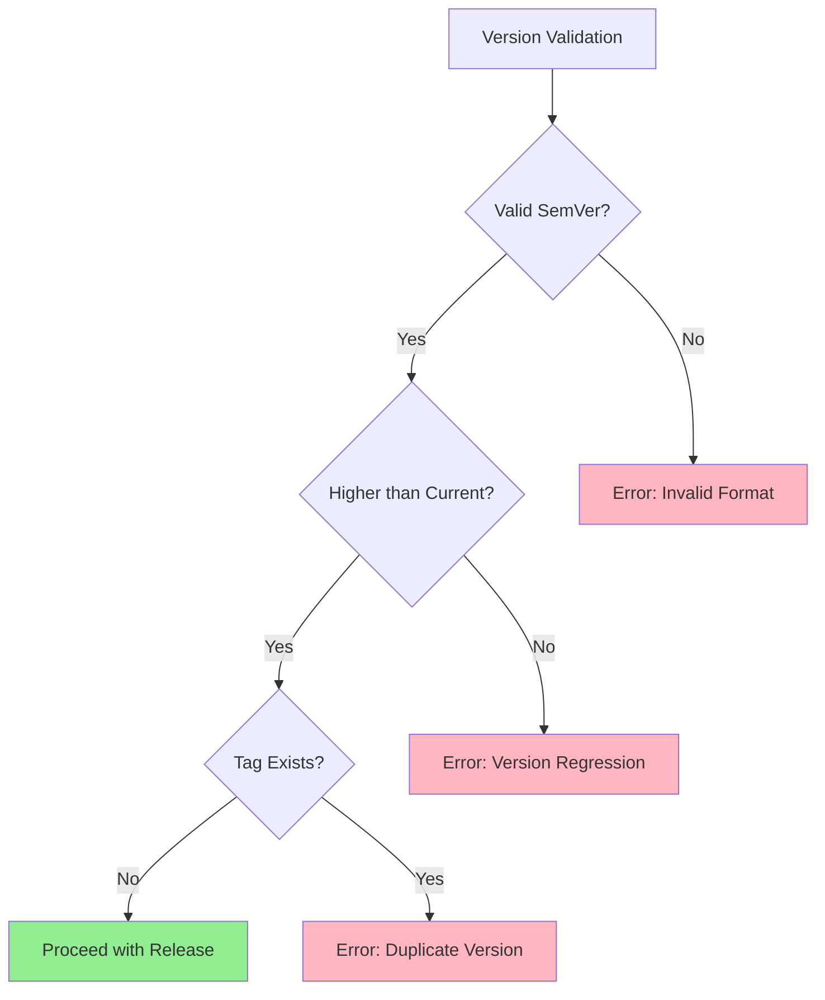

### Version Conflict Resolution

When automation meets manual overrides:

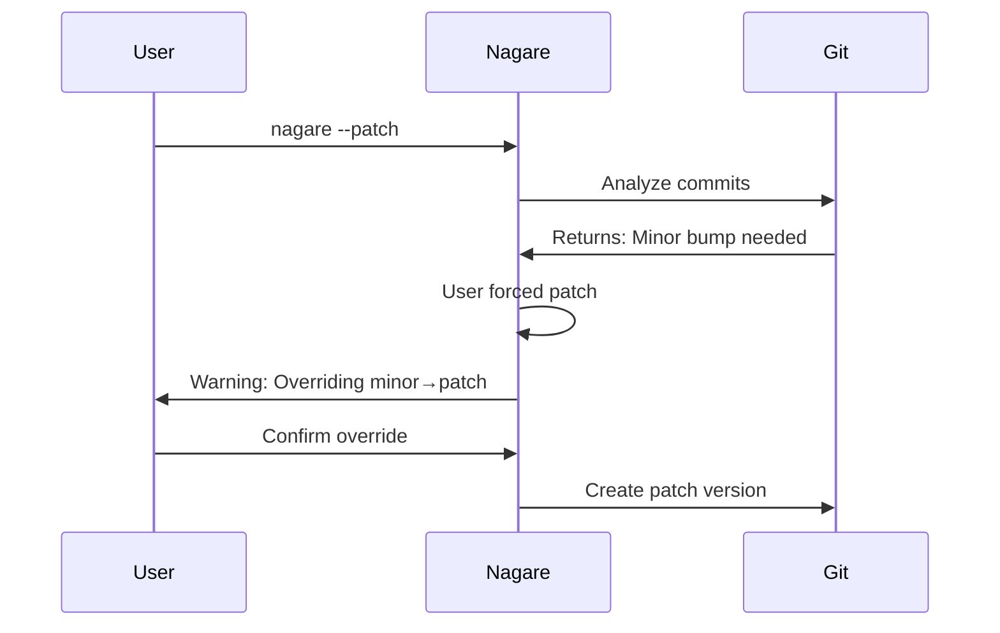

## Version History and Rollback

### Rollback Capabilities

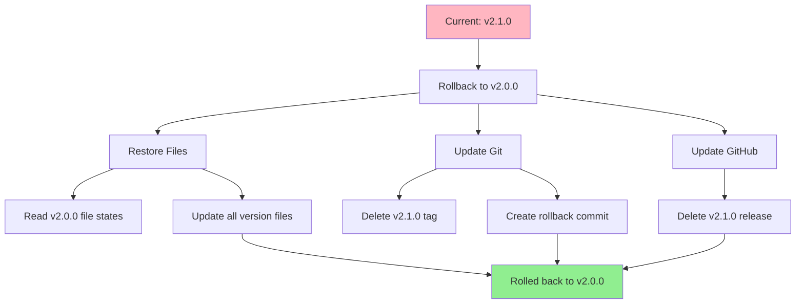

## Comparison with Version Management Approaches

| Approach | Version Source | Pros | Cons | Best For |
|----------|---------------|------|------|----------|
| Nagare (Conventional) | Git commit messages | Automatic, consistent | Requires discipline | Teams following conventions |
| Manual Updates | Developer decision | Full control | Error-prone, inconsistent | Small projects |
| Calendar Versioning | Date-based | Simple, predictable | No compatibility info | Regular releases |
| Git Hash Versioning | Commit SHA | Unique, traceable | Not semantic | Continuous deployment |

## Advanced Version Strategies

### Synchronized Multi-Package Releases

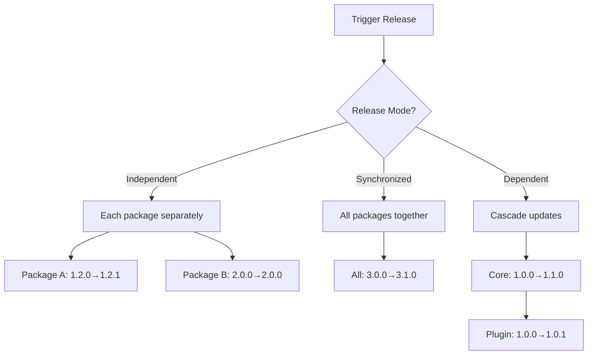

### Version Pinning and Constraints

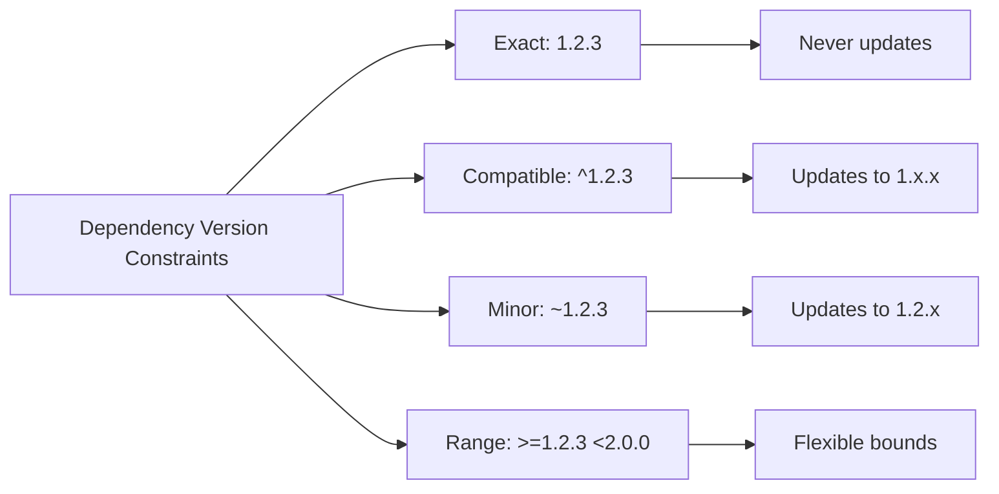

## Security Considerations

Version management has security implications:

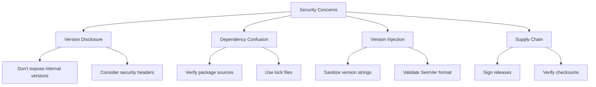

## Best Practices

1. **Commit Message Discipline**: Train your team on conventional commits
2. **Version File Consistency**: Always update all version locations together
3. **Pre-release Testing**: Use pre-release versions for major changes
4. **Changelog Maintenance**: Keep CHANGELOG.md synchronized with versions
5. **Tag Protection**: Protect version tags in your git repository
6. **Automation First**: Let Nagare calculate versions to ensure consistency

## Further Reading

- [Semantic Versioning 2.0.0](https://semver.org/)
- [Conventional Commits 1.0.0](https://www.conventionalcommits.org/)
- [Release Workflow Concepts](./concepts-release-workflow.md)
- [Architecture Overview](./concepts-architecture.md)
- [How to Configure Version Updates](./how-to-configure-version-updates.md)