# Understanding Nagare's architecture

## Overview

Nagare's architecture follows a manager-based design pattern where specialized components handle specific aspects of the
release process. This modular approach enables flexibility, testability, and clear separation of concerns. Understanding
this architecture helps you extend Nagare, contribute to the project, or build similar tools.

## Why this architecture?

Software release management involves multiple complex operations:

- Git repository manipulation.
- File system operations.
- Version calculations.
- Template processing.
- External service integration.

Without clear architectural boundaries, these concerns become entangled, making the system difficult to understand,
test, and extend. Nagare's architecture provides structure while maintaining flexibility.

## High-level architecture

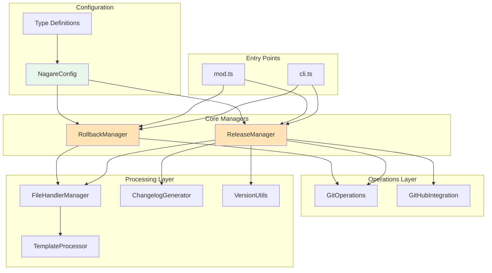

## Component deep dive

### Manager components

Managers orchestrate complex workflows by coordinating multiple operations:

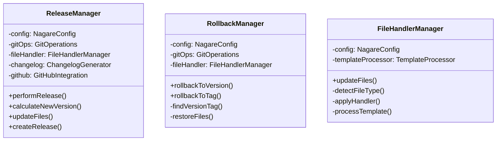

**Design Decision**: The manager pattern provides clear ownership of workflows while keeping individual operations
simple and testable.

### Operations Layer

Operations components handle direct interactions with external systems:

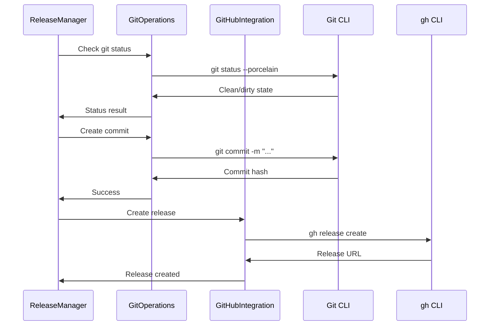

**Trade-offs**:

- **Advantages**: Clear abstraction over CLI tools, easy to mock for testing
- **Limitations**: Depends on external tools being installed

### File Handler Architecture

The file handler system provides extensibility through multiple strategies:

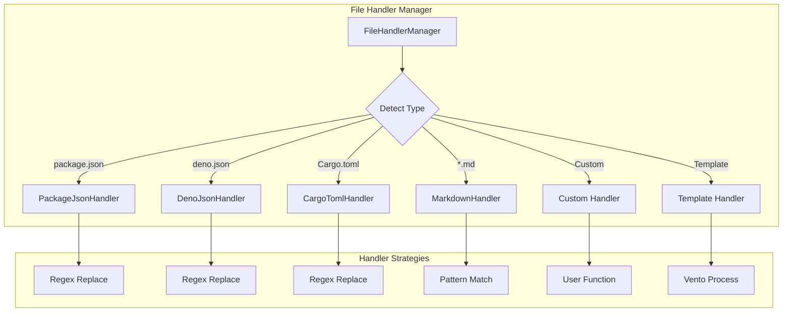

### Template Processing Architecture

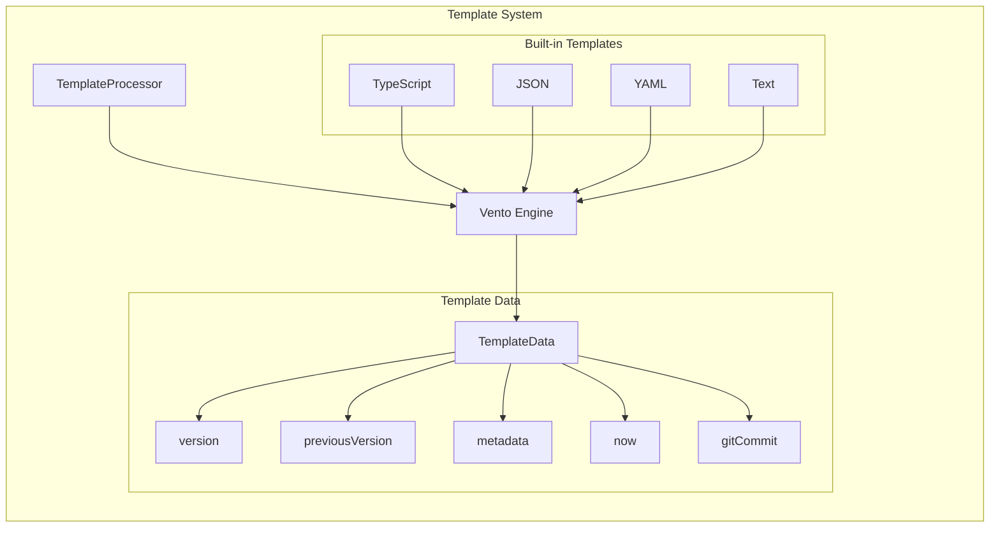

## Data Flow

### Release Process Data Flow

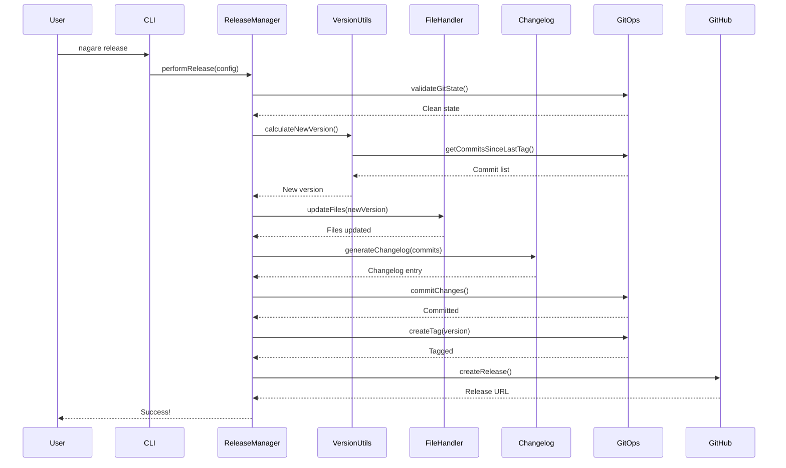

## Design Decisions

### Why Manager-Based Architecture?

**Advantages**:

- Clear separation of concerns
- Easy to test individual components
- Workflow logic separated from implementation details
- Natural extension points

**Trade-offs**:

- More files and indirection
- Requires understanding the component hierarchy
- Potential for over-abstraction

### Why Wrap CLI Tools?

Nagare wraps `git` and `gh` CLI tools rather than using libraries:

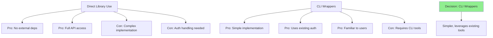

### Configuration-Driven Design

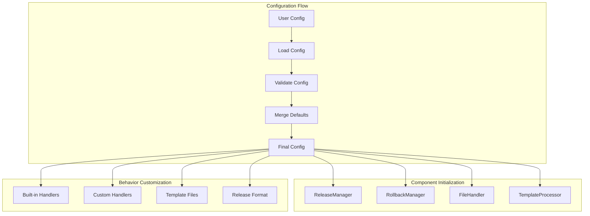

## Extension Points

### Adding New File Handlers

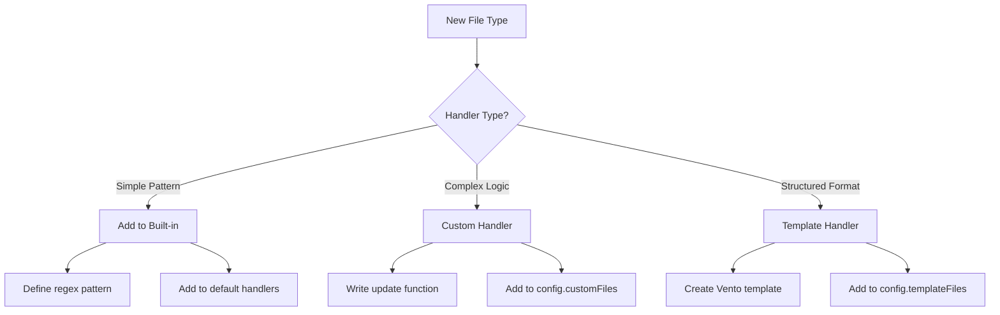

### Adding New Commands

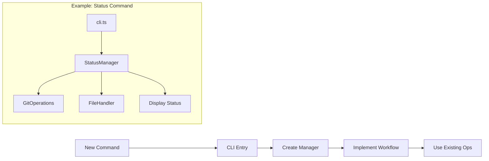

## Error Handling Architecture

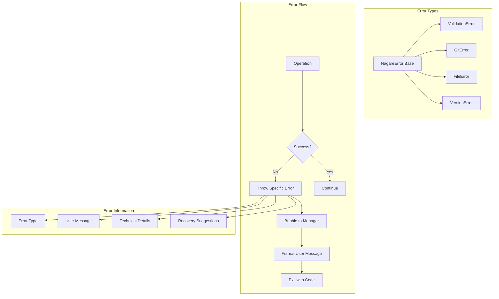

## Security Architecture

### Input Validation Layers

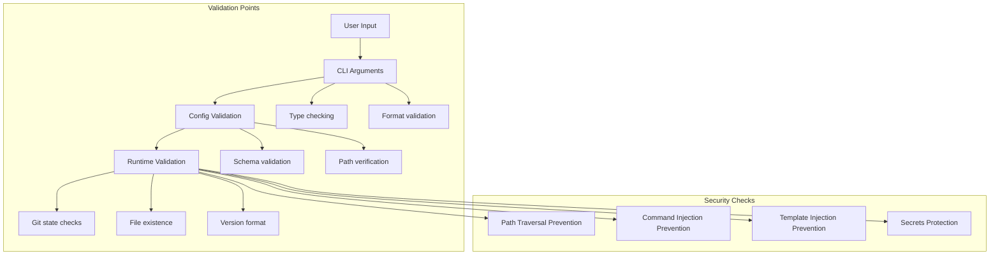

### Secure Operations

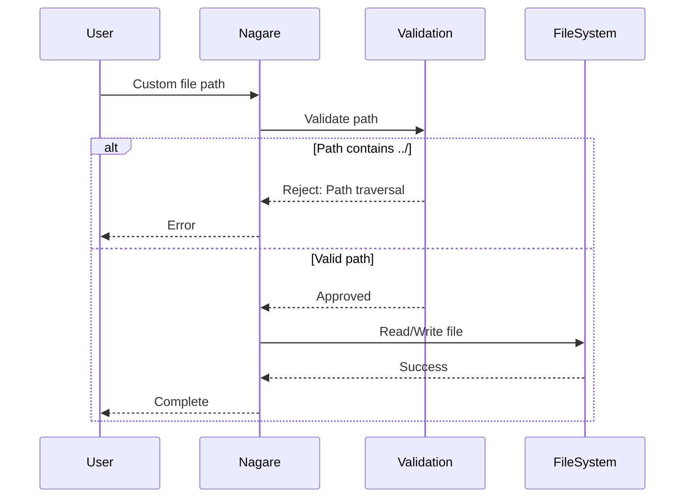

## Performance Considerations

### Optimization Strategies

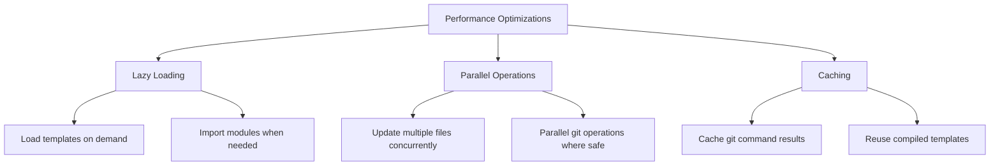

## Testing Architecture

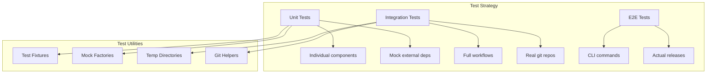

## Comparison with Alternative Architectures

| Architecture           | Approach              | Pros                      | Cons                    | Best For          |
| ---------------------- | --------------------- | ------------------------- | ----------------------- | ----------------- |
| Manager-Based (Nagare) | Orchestration classes | Clear workflows, testable | More code structure     | Complex workflows |
| Functional Pipeline    | Pure functions        | Simple, composable        | Harder state management | Simple transforms |
| Plugin Architecture    | Dynamic loading       | Extremely flexible        | Complex, slower         | Large ecosystems  |
| Monolithic Script      | Single file           | Simple to understand      | Hard to test/extend     | Small tools       |

## Future Architecture Considerations

### Potential Enhancements

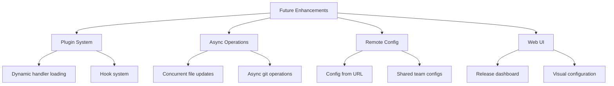

### Maintaining Architecture Quality

1. **Component Boundaries**: Keep clear separation between managers, operations, and utilities
2. **Dependency Direction**: Dependencies should flow inward (operations don't know about managers)
3. **Type Safety**: Leverage TypeScript's type system for compile-time guarantees
4. **Error Handling**: Consistent error types and user-friendly messages
5. **Testing**: Each component should be independently testable

## Further Reading

- [Release Workflow Concepts](./release-workflow.md)
- [Version Management Concepts](./version-management.md)
- [API Reference](https://nagare.esolia.deno.net/)
- [Contributing Guide](../CONTRIBUTING.md)
