# Understanding Nagare's File Update System

## Overview

Nagare's file update system is one of its most powerful features, automatically updating version numbers across multiple
files in your project. This system uses intelligent handlers to detect file types and apply appropriate update
strategies, from simple regex replacements to complex template processing.

## Why Intelligent File Updates Matter

Manual version updates are error-prone and time-consuming. Common issues include:

- Forgetting to update version numbers in multiple files
- Inconsistent version formatting across file types
- Breaking JSON/YAML syntax with incorrect updates
- Missing version references in documentation

Nagare's intelligent system solves these problems with automated, safe updates.

## File Update Architecture

### System Overview

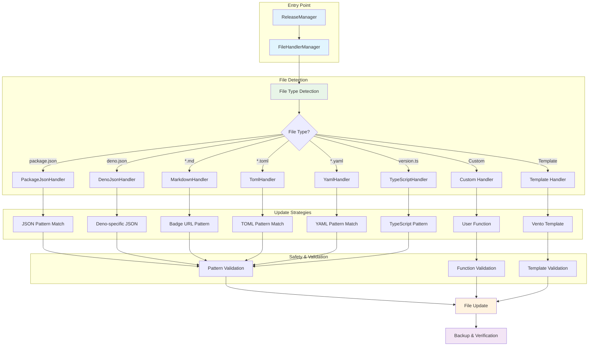
```mermaid
graph TB
    subgraph "Entry Point"
        A[ReleaseManager] --> B[FileHandlerManager]
    end
    
    subgraph "File Detection"
        B --> C[File Type Detection]
        C --> D{File Type?}
        D -->|package.json| E[PackageJsonHandler]
        D -->|deno.json| F[DenoJsonHandler]
        D -->|*.md| G[MarkdownHandler]
        D -->|*.toml| H[TomlHandler]
        D -->|*.yaml| I[YamlHandler]
        D -->|version.ts| J[TypeScriptHandler]
        D -->|Custom| K[Custom Handler]
        D -->|Template| L[Template Handler]
    end
    
    subgraph "Update Strategies"
        E --> M[JSON Pattern Match]
        F --> N[Deno-specific JSON]
        G --> O[Badge URL Pattern]
        H --> P[TOML Pattern Match]
        I --> Q[YAML Pattern Match]
        J --> R[TypeScript Pattern]
        K --> S[User Function]
        L --> T[Vento Template]
    end
    
    subgraph "Safety & Validation"
        M --> U[Pattern Validation]
        N --> U
        O --> U
        P --> U
        Q --> U
        R --> U
        S --> V[Function Validation]
        T --> W[Template Validation]
    end
    
    U --> X[File Update]
    V --> X
    W --> X
    X --> Y[Backup & Verification]
    
    style A fill:#e3f2fd
    style B fill:#e1f5fe
    style C fill:#e8f5e8
    style X fill:#fff3e0
    style Y fill:#f3e5f5
```

### Handler Selection Process

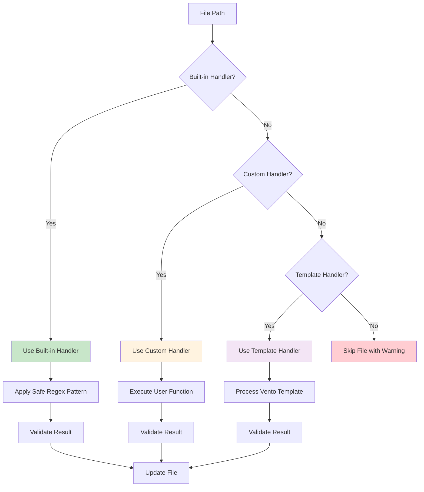
```mermaid
flowchart TD
    A[File Path] --> B{Built-in Handler?}
    B -->|Yes| C[Use Built-in Handler]
    B -->|No| D{Custom Handler?}
    D -->|Yes| E[Use Custom Handler]
    D -->|No| F{Template Handler?}
    F -->|Yes| G[Use Template Handler]
    F -->|No| H[Skip File with Warning]
    
    C --> I[Apply Safe Regex Pattern]
    E --> J[Execute User Function]
    G --> K[Process Vento Template]
    
    I --> L[Validate Result]
    J --> M[Validate Result]
    K --> N[Validate Result]
    
    L --> O[Update File]
    M --> O
    N --> O
    
    style C fill:#c8e6c9
    style E fill:#fff3e0
    style G fill:#f3e5f5
    style H fill:#ffcdd2
```

## Built-in Handlers

### JSON File Handlers

Nagare includes specialized handlers for different JSON file types:

```mermaid
graph LR
    subgraph "JSON Handlers"
        A[package.json] --> B[NPM Package Handler]
        C[deno.json] --> D[Deno Config Handler]
        E[jsr.json] --> F[JSR Package Handler]
        G[composer.json] --> H[Composer Handler]
        I[*.json] --> J[Generic JSON Handler]
    end
    
    subgraph "Pattern Matching"
        B --> K["^(\s*)\"version\":\s*\"[^\"]+\""]
        D --> L["^(\s*)\"version\":\s*\"[^\"]+\""]
        F --> M["^(\s*)\"version\":\s*\"[^\"]+\""]
        H --> N["^(\s*)\"version\":\s*\"[^\"]+\""]
        J --> O["^(\s*)\"version\":\s*\"[^\"]+\""]
    end
    
    style B fill:#e8f5e8
    style D fill:#e8f5e8
    style F fill:#e8f5e8
    style H fill:#e8f5e8
    style J fill:#e8f5e8
```

**Key Features:**

- **Line-anchored patterns** prevent matching nested versions
- **Whitespace preservation** maintains JSON formatting
- **Syntax validation** ensures valid JSON after updates

### Markdown Handler

Updates version badges and references in Markdown files:

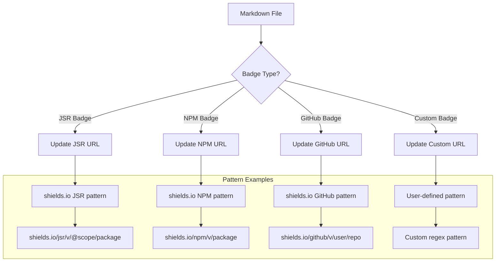
```mermaid
graph TD
    A[Markdown File] --> B{Badge Type?}
    B -->|JSR Badge| C[Update JSR URL]
    B -->|NPM Badge| D[Update NPM URL]
    B -->|GitHub Badge| E[Update GitHub URL]
    B -->|Custom Badge| F[Update Custom URL]
    
    C --> G[shields.io JSR pattern]
    D --> H[shields.io NPM pattern]
    E --> I[shields.io GitHub pattern]
    F --> J[User-defined pattern]
    
    subgraph "Pattern Examples"
        G --> K["shields.io/jsr/v/@scope/package"]
        H --> L["shields.io/npm/v/package"]
        I --> M["shields.io/github/v/user/repo"]
        J --> N["Custom regex pattern"]
    end
```

### Language-Specific Handlers

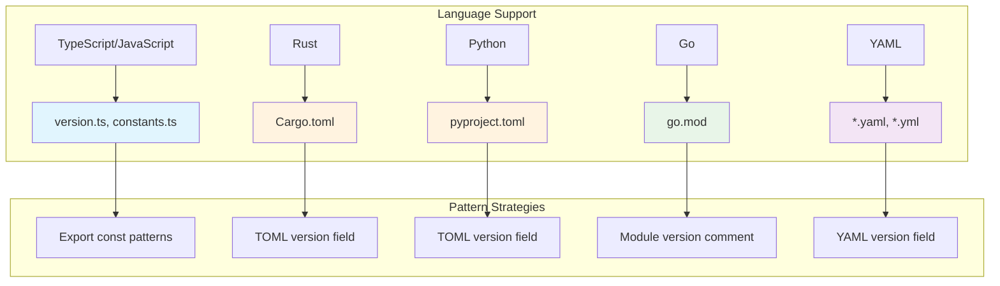
```mermaid
graph TB
    subgraph "Language Support"
        A[TypeScript/JavaScript] --> B[version.ts, constants.ts]
        C[Rust] --> D[Cargo.toml]
        E[Python] --> F[pyproject.toml]
        G[Go] --> H[go.mod]
        I[YAML] --> J[*.yaml, *.yml]
    end
    
    subgraph "Pattern Strategies"
        B --> K[Export const patterns]
        D --> L[TOML version field]
        F --> M[TOML version field]
        H --> N[Module version comment]
        J --> O[YAML version field]
    end
    
    style B fill:#e1f5fe
    style D fill:#fff3e0
    style F fill:#fff3e0
    style H fill:#e8f5e8
    style J fill:#f3e5f5
```

## Custom Handlers

### Function-Based Handlers

For complex update logic, you can provide custom functions:

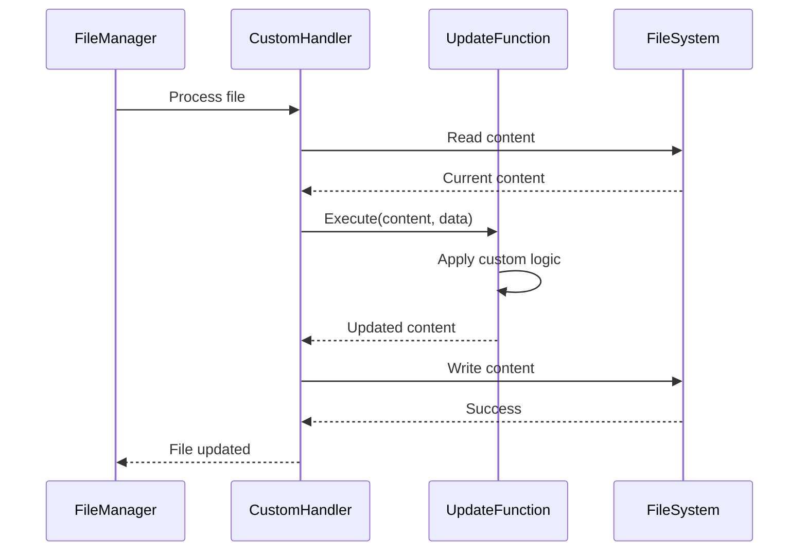
```mermaid
sequenceDiagram
    participant FM as FileManager
    participant CH as CustomHandler
    participant UF as UpdateFunction
    participant File as FileSystem
    
    FM->>CH: Process file
    CH->>File: Read content
    File-->>CH: Current content
    CH->>UF: Execute(content, data)
    UF->>UF: Apply custom logic
    UF-->>CH: Updated content
    CH->>File: Write content
    File-->>CH: Success
    CH-->>FM: File updated
```

**Example Custom Handler:**

```typescript
{
  path: "./src/constants.py",
  updateFn: (content, { version }) => {
    // Custom Python version update
    return content.replace(
      /VERSION\s*=\s*["'][^"']+["']/,
      `VERSION = "${version}"`
    );
  }
}
```

### Template-Based Handlers

For complex file generation, use Vento templates:

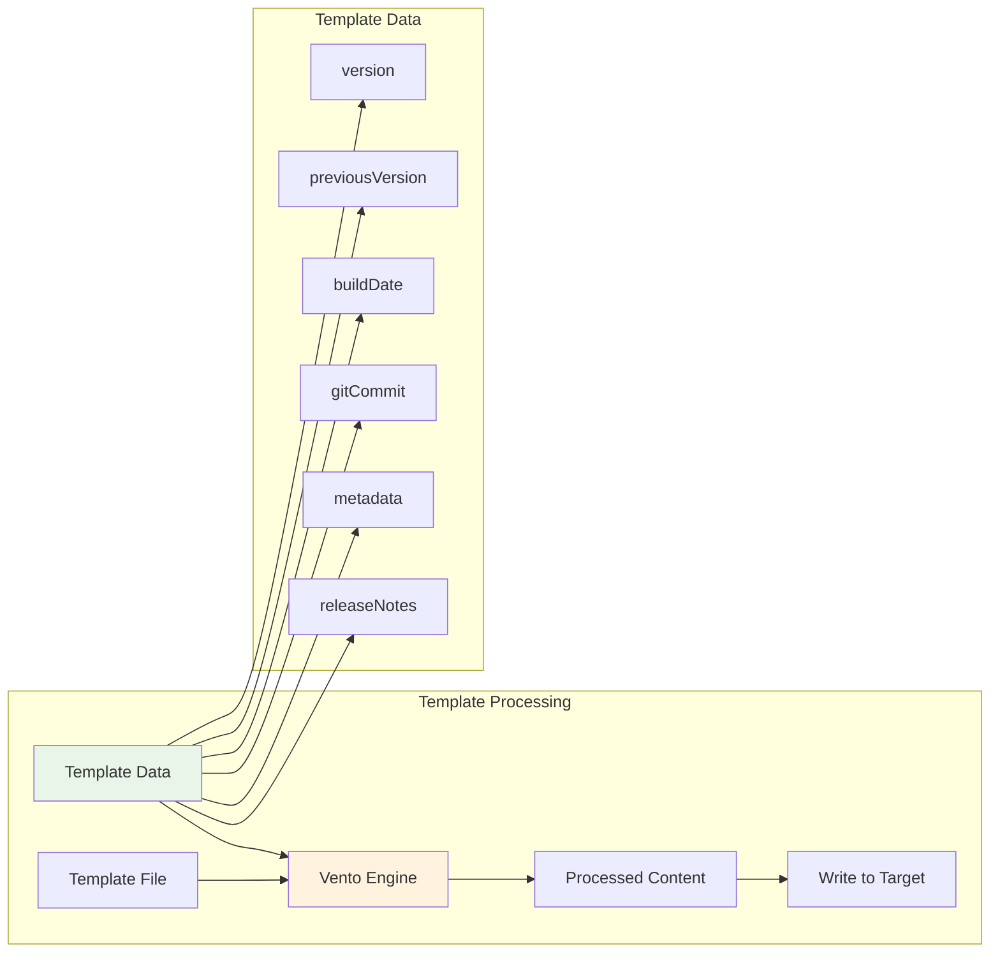
```mermaid
graph LR
    subgraph "Template Processing"
        A[Template File] --> B[Vento Engine]
        C[Template Data] --> B
        B --> D[Processed Content]
        D --> E[Write to Target]
    end
    
    subgraph "Template Data"
        C --> F[version]
        C --> G[previousVersion]
        C --> H[buildDate]
        C --> I[gitCommit]
        C --> J[metadata]
        C --> K[releaseNotes]
    end
    
    style B fill:#fff3e0
    style C fill:#e8f5e8
```

## Safety Mechanisms

### Pattern Validation

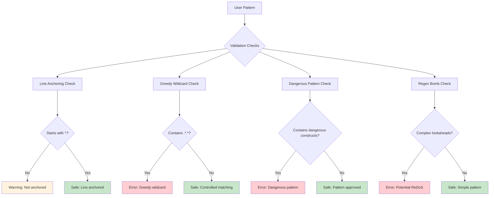
```mermaid
graph TD
    A[User Pattern] --> B{Validation Checks}
    B --> C[Line Anchoring Check]
    B --> D[Greedy Wildcard Check]
    B --> E[Dangerous Pattern Check]
    B --> F[Regex Bomb Check]
    
    C --> G{Starts with ^?}
    G -->|No| H[Warning: Not anchored]
    G -->|Yes| I[Safe: Line anchored]
    
    D --> J{Contains .*.*?}
    J -->|Yes| K[Error: Greedy wildcard]
    J -->|No| L[Safe: Controlled matching]
    
    E --> M{Contains dangerous constructs?}
    M -->|Yes| N[Error: Dangerous pattern]
    M -->|No| O[Safe: Pattern approved]
    
    F --> P{Complex lookaheads?}
    P -->|Yes| Q[Error: Potential ReDoS]
    P -->|No| R[Safe: Simple pattern]
    
    style I fill:#c8e6c9
    style L fill:#c8e6c9
    style O fill:#c8e6c9
    style R fill:#c8e6c9
    style H fill:#fff3e0
    style K fill:#ffcdd2
    style N fill:#ffcdd2
    style Q fill:#ffcdd2
```

### Backup and Rollback

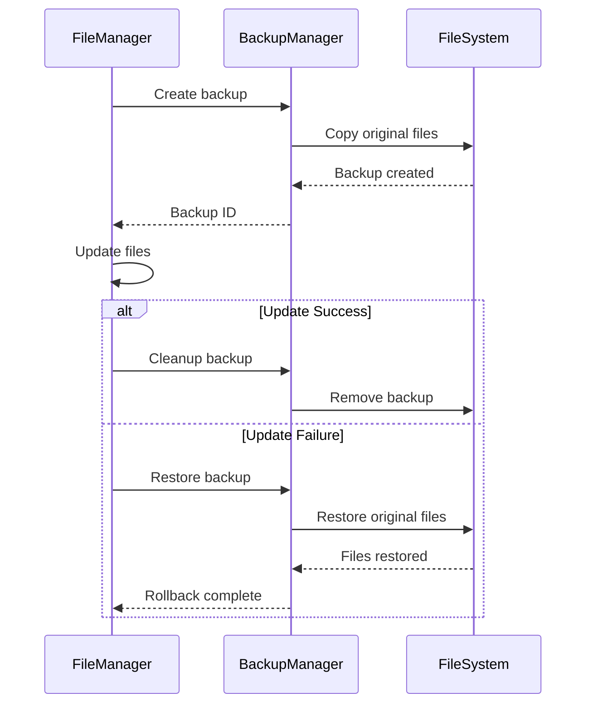
```mermaid
sequenceDiagram
    participant FM as FileManager
    participant BM as BackupManager
    participant FS as FileSystem
    
    FM->>BM: Create backup
    BM->>FS: Copy original files
    FS-->>BM: Backup created
    BM-->>FM: Backup ID
    
    FM->>FM: Update files
    
    alt Update Success
        FM->>BM: Cleanup backup
        BM->>FS: Remove backup
    else Update Failure
        FM->>BM: Restore backup
        BM->>FS: Restore original files
        FS-->>BM: Files restored
        BM-->>FM: Rollback complete
    end
```

## Advanced Features

### Conditional Updates

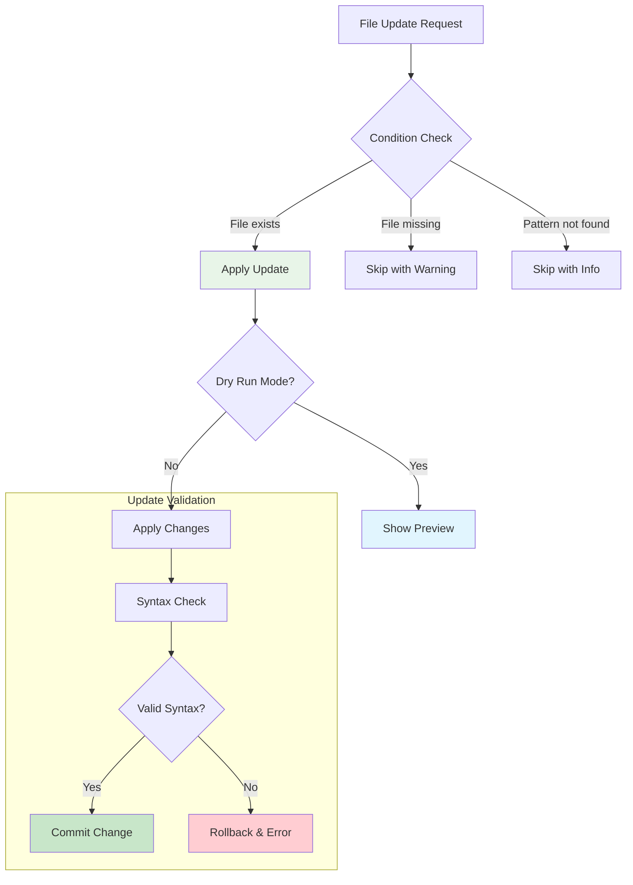
```mermaid
graph TD
    A[File Update Request] --> B{Condition Check}
    B -->|File exists| C[Apply Update]
    B -->|File missing| D[Skip with Warning]
    B -->|Pattern not found| E[Skip with Info]
    
    C --> F{Dry Run Mode?}
    F -->|Yes| G[Show Preview]
    F -->|No| H[Apply Changes]
    
    subgraph "Update Validation"
        H --> I[Syntax Check]
        I --> J{Valid Syntax?}
        J -->|Yes| K[Commit Change]
        J -->|No| L[Rollback & Error]
    end
    
    style C fill:#e8f5e8
    style G fill:#e1f5fe
    style K fill:#c8e6c9
    style L fill:#ffcdd2
```

### Multi-File Coordination

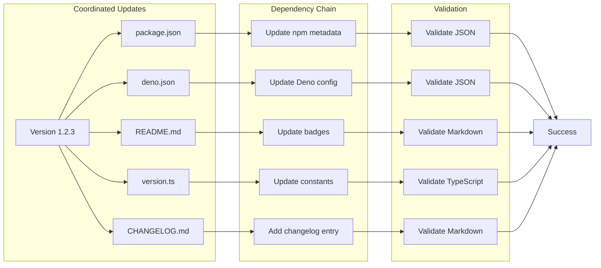
```mermaid
graph LR
    subgraph "Coordinated Updates"
        A[Version 1.2.3] --> B[package.json]
        A --> C[deno.json]
        A --> D[README.md]
        A --> E[version.ts]
        A --> F[CHANGELOG.md]
    end
    
    subgraph "Dependency Chain"
        B --> G[Update npm metadata]
        C --> H[Update Deno config]
        D --> I[Update badges]
        E --> J[Update constants]
        F --> K[Add changelog entry]
    end
    
    subgraph "Validation"
        G --> L[Validate JSON]
        H --> M[Validate JSON]
        I --> N[Validate Markdown]
        J --> O[Validate TypeScript]
        K --> P[Validate Markdown]
    end
    
    L --> Q[Success]
    M --> Q
    N --> Q
    O --> Q
    P --> Q
```

## Performance Optimizations

### Concurrent Processing

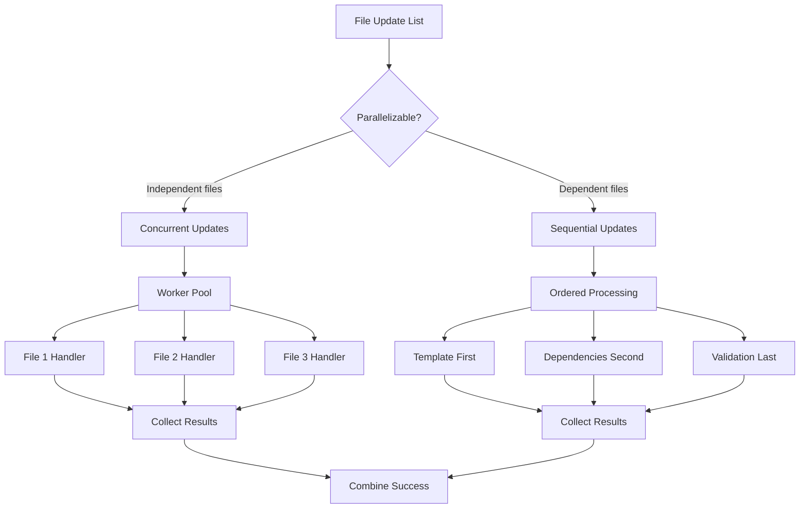
```mermaid
graph TD
    A[File Update List] --> B{Parallelizable?}
    B -->|Independent files| C[Concurrent Updates]
    B -->|Dependent files| D[Sequential Updates]
    
    C --> E[Worker Pool]
    E --> F[File 1 Handler]
    E --> G[File 2 Handler]
    E --> H[File 3 Handler]
    
    D --> I[Ordered Processing]
    I --> J[Template First]
    I --> K[Dependencies Second]
    I --> L[Validation Last]
    
    F --> M[Collect Results]
    G --> M
    H --> M
    
    J --> N[Collect Results]
    K --> N
    L --> N
    
    M --> O[Combine Success]
    N --> O
```

### Caching Strategy

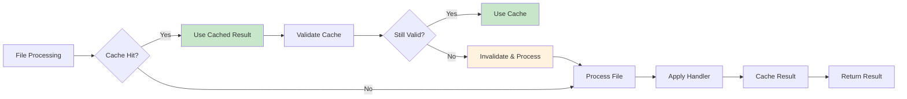
```mermaid
graph LR
    A[File Processing] --> B{Cache Hit?}
    B -->|Yes| C[Use Cached Result]
    B -->|No| D[Process File]
    
    D --> E[Apply Handler]
    E --> F[Cache Result]
    F --> G[Return Result]
    
    C --> H[Validate Cache]
    H --> I{Still Valid?}
    I -->|Yes| J[Use Cache]
    I -->|No| K[Invalidate & Process]
    
    K --> D
    
    style C fill:#c8e6c9
    style J fill:#c8e6c9
    style K fill:#fff3e0
```

## Error Handling

### Error Recovery Strategy

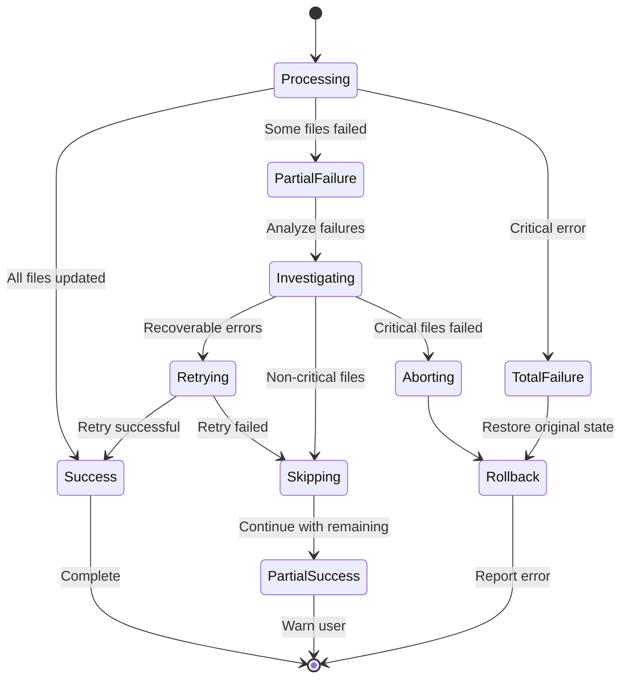
```mermaid
stateDiagram-v2
    [*] --> Processing
    Processing --> Success: All files updated
    Processing --> PartialFailure: Some files failed
    Processing --> TotalFailure: Critical error
    
    PartialFailure --> Investigating: Analyze failures
    Investigating --> Retrying: Recoverable errors
    Investigating --> Skipping: Non-critical files
    Investigating --> Aborting: Critical files failed
    
    Retrying --> Success: Retry successful
    Retrying --> Skipping: Retry failed
    
    Skipping --> PartialSuccess: Continue with remaining
    PartialSuccess --> [*]: Warn user
    
    TotalFailure --> Rollback: Restore original state
    Rollback --> [*]: Report error
    
    Aborting --> Rollback
    
    Success --> [*]: Complete
```

### Error Classification

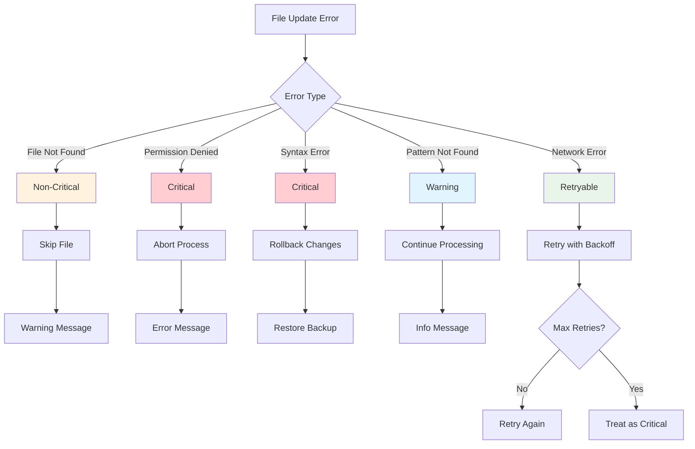
```mermaid
graph TD
    A[File Update Error] --> B{Error Type}
    B -->|File Not Found| C[Non-Critical]
    B -->|Permission Denied| D[Critical]
    B -->|Syntax Error| E[Critical]
    B -->|Pattern Not Found| F[Warning]
    B -->|Network Error| G[Retryable]
    
    C --> H[Skip File]
    D --> I[Abort Process]
    E --> J[Rollback Changes]
    F --> K[Continue Processing]
    G --> L[Retry with Backoff]
    
    H --> M[Warning Message]
    I --> N[Error Message]
    J --> O[Restore Backup]
    K --> P[Info Message]
    L --> Q{Max Retries?}
    
    Q -->|No| R[Retry Again]
    Q -->|Yes| S[Treat as Critical]
    
    style C fill:#fff3e0
    style D fill:#ffcdd2
    style E fill:#ffcdd2
    style F fill:#e1f5fe
    style G fill:#e8f5e8
```

## Best Practices

### Configuration Guidelines

```mermaid
graph TD
    A[Configuration Best Practices] --> B[Use Built-in Handlers]
    A --> C[Line-Anchored Patterns]
    A --> D[Specific Matching]
    A --> E[Test in Dry Run]
    
    B --> F[✅ { path: "./package.json" }]
    B --> G[❌ Custom regex for JSON]
    
    C --> H[✅ /^(\s*)"version":/m]
    C --> I[❌ /"version":/]
    
    D --> J[✅ Match exact format]
    D --> K[❌ Greedy wildcards]
    
    E --> L[✅ --dry-run first]
    E --> M[❌ Direct production]
    
    style F fill:#c8e6c9
    style G fill:#ffcdd2
    style H fill:#c8e6c9
    style I fill:#ffcdd2
    style J fill:#c8e6c9
    style K fill:#ffcdd2
    style L fill:#c8e6c9
    style M fill:#ffcdd2
```

### Testing Strategy

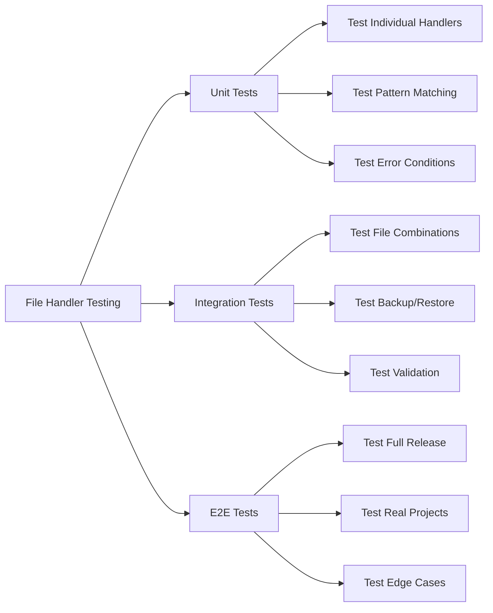
```mermaid
graph LR
    A[File Handler Testing] --> B[Unit Tests]
    A --> C[Integration Tests]
    A --> D[E2E Tests]
    
    B --> E[Test Individual Handlers]
    B --> F[Test Pattern Matching]
    B --> G[Test Error Conditions]
    
    C --> H[Test File Combinations]
    C --> I[Test Backup/Restore]
    C --> J[Test Validation]
    
    D --> K[Test Full Release]
    D --> L[Test Real Projects]
    D --> M[Test Edge Cases]
```

## Troubleshooting

### Common Issues

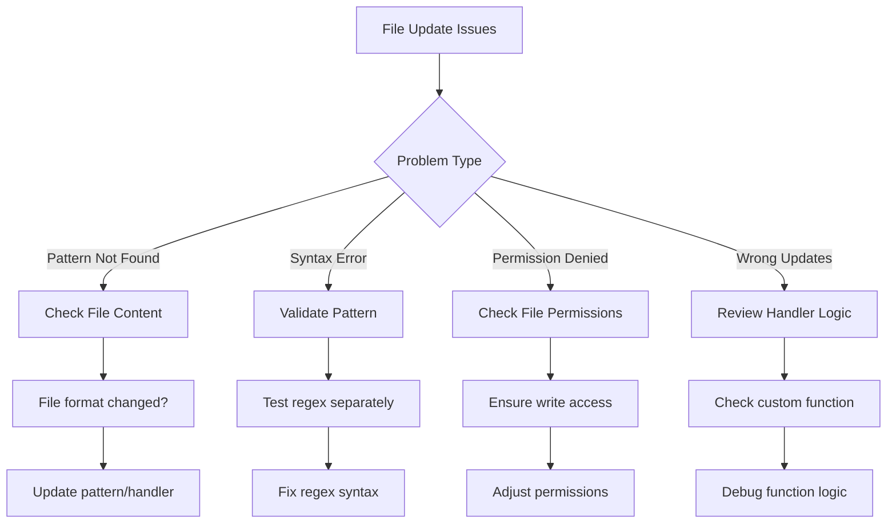
```mermaid
graph TD
    A[File Update Issues] --> B{Problem Type}
    B -->|Pattern Not Found| C[Check File Content]
    B -->|Syntax Error| D[Validate Pattern]
    B -->|Permission Denied| E[Check File Permissions]
    B -->|Wrong Updates| F[Review Handler Logic]
    
    C --> G[File format changed?]
    D --> H[Test regex separately]
    E --> I[Ensure write access]
    F --> J[Check custom function]
    
    G --> K[Update pattern/handler]
    H --> L[Fix regex syntax]
    I --> M[Adjust permissions]
    J --> N[Debug function logic]
```

### Debugging Tools

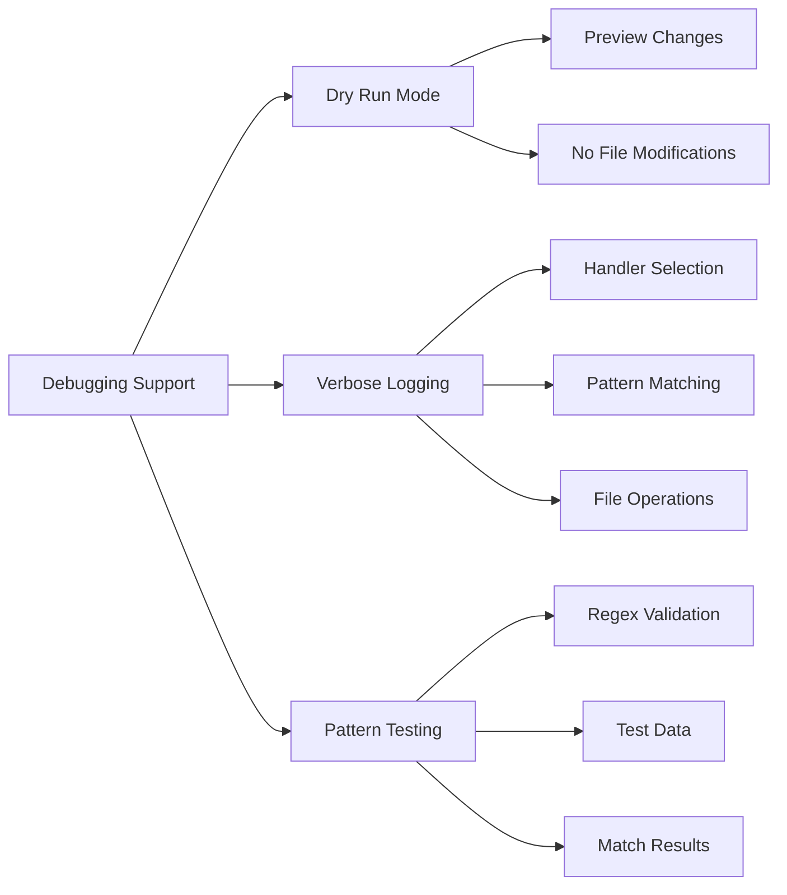
```mermaid
graph LR
    A[Debugging Support] --> B[Dry Run Mode]
    A --> C[Verbose Logging]
    A --> D[Pattern Testing]
    
    B --> E[Preview Changes]
    B --> F[No File Modifications]
    
    C --> G[Handler Selection]
    C --> H[Pattern Matching]
    C --> I[File Operations]
    
    D --> J[Regex Validation]
    D --> K[Test Data]
    D --> L[Match Results]
```

## Further Reading

- [Configuration Reference](../reference/configuration.md) - Complete configuration options
- [Template Reference](../reference/templates.md) - Template system documentation
- [CLI Reference](../reference/cli.md) - Command-line interface
- [Architecture Overview](./architecture.md) - Overall system design
- [Security Model](./security-model.md) - Security considerations
