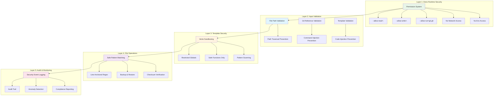
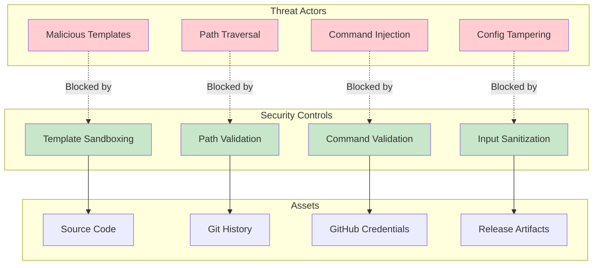

# Understanding Nagare's Security Model

## Overview

Nagare's security model is built on defense-in-depth principles, leveraging Deno's permission system and implementing comprehensive security measures at every layer. This document explains the security architecture and how it protects against common threats.

## Security Architecture

### Security Layer Overview



### Threat Model Visualization



### Core Security Principles

**1. Secure by Default**

- All features are designed with security as the primary concern
- Safe defaults prevent common security mistakes
- Explicit configuration required for potentially dangerous operations

**2. Principle of Least Privilege**

- Minimal permissions requested from Deno runtime
- File access limited to necessary directories
- Network access restricted to required endpoints

**3. Defense in Depth**

- Multiple security layers provide redundant protection
- Each layer addresses different attack vectors
- Comprehensive logging for security audit trails

## Threat Model

### Assets Protected

**Primary Assets**:

- Source code repository integrity
- Version control history
- GitHub API credentials
- Release artifacts and metadata

**Secondary Assets**:

- Local development environment
- CI/CD pipeline integrity
- Team collaboration workflows

### Attack Vectors

**1. Template Injection**

- Malicious templates executing arbitrary code
- Unauthorized file system access
- Information disclosure through template errors

**2. Path Traversal**

- Directory traversal attacks via file paths
- Unauthorized access to system files
- Escape from project sandbox

**3. Command Injection**

- Shell command injection via user inputs
- Execution of arbitrary system commands
- Privilege escalation through command chaining

**4. Configuration Tampering**

- Malicious configuration modifications
- Unauthorized file pattern modifications
- Bypass of security restrictions

## Security Layers

### Layer 1: Deno Runtime Security

**Permission System**:
```bash
# Minimal permissions for Nagare
deno run --allow-read=. --allow-write=. --allow-run=git,gh nagare-launcher.ts
```

**Permitted Operations**:

- `--allow-read=.`: Read files only within project directory
- `--allow-write=.`: Write files only within project directory
- `--allow-run=git,gh`: Execute only git and GitHub CLI commands

**Restricted Operations**:

- Network access (unless explicitly granted)
- Environment variable access (unless explicitly granted)
- System command execution (beyond git and gh)

### Layer 2: Input Validation

**File Path Validation**:
```typescript
export function validateFilePath(path: string, basePath: string): string {
  // Resolve absolute path
  const resolvedPath = resolve(path);
  const resolvedBase = resolve(basePath);
  
  // Check for directory traversal
  if (!resolvedPath.startsWith(resolvedBase)) {
    throw new NagareError(
      "Path traversal attempt detected",
      ErrorCodes.SECURITY_PATH_TRAVERSAL,
      { path, basePath }
    );
  }
  
  // Check for null bytes
  if (path.includes('\0')) {
    throw new NagareError(
      "Null byte injection attempt",
      ErrorCodes.SECURITY_NULL_BYTE_INJECTION,
      { path }
    );
  }
  
  return resolvedPath;
}
```

**Git Reference Validation**:
```typescript
export function validateGitRef(ref: string, type: "tag" | "branch"): string {
  // Length validation
  if (ref.length > 255) {
    throw new NagareError(
      "Git reference too long",
      ErrorCodes.SECURITY_GIT_TAG_TOO_LONG,
      { ref, maxLength: 255 }
    );
  }
  
  // Character validation
  const invalidChars = /[<>:"|?*\x00-\x1f\x7f]/;
  if (invalidChars.test(ref)) {
    throw new NagareError(
      "Invalid characters in git reference",
      ErrorCodes.SECURITY_INVALID_GIT_REF_CHARS,
      { ref, invalidChars: invalidChars.source }
    );
  }
  
  // Pattern validation
  const gitRefPattern = /^[a-zA-Z0-9][a-zA-Z0-9._/-]*[a-zA-Z0-9]$/;
  if (!gitRefPattern.test(ref)) {
    throw new NagareError(
      "Invalid git reference format",
      ErrorCodes.SECURITY_INVALID_GIT_REF_PATTERN,
      { ref, requiredPattern: gitRefPattern.source }
    );
  }
  
  return ref;
}
```

### Layer 3: Template Sandboxing

**Vento Security Configuration**:
```typescript
export class TemplateProcessor {
  private setupSecurityContext(): void {
    // Disable dangerous functions
    const restrictedGlobals = [
      'eval', 'Function', 'setTimeout', 'setInterval',
      'require', 'import', 'process', 'global',
      'Deno', 'fetch', 'XMLHttpRequest'
    ];
    
    // Create secure context
    this.vento.options.environment = {
      // Only allow safe built-in functions
      Math, JSON, Date, String, Number, Array, Object,
      
      // Custom safe functions
      jsonStringify: (obj: any) => JSON.stringify(obj),
      safe: (str: string) => str.toString(),
      
      // Block dangerous globals
      ...restrictedGlobals.reduce((acc, name) => {
        acc[name] = undefined;
        return acc;
      }, {} as Record<string, undefined>)
    };
  }
}
```

**Template Validation**:
```typescript
export function validateTemplate(template: string): void {
  // Check for dangerous patterns
  const dangerousPatterns = [
    /import\s+/,           // ES6 imports
    /require\s*\(/,        // CommonJS requires
    /eval\s*\(/,           // eval function
    /Function\s*\(/,       // Function constructor
    /setTimeout\s*\(/,     // setTimeout
    /setInterval\s*\(/,    // setInterval
    /fetch\s*\(/,          // fetch API
    /XMLHttpRequest/,      // XMLHttpRequest
    /document\./,          // DOM access
    /window\./,            // window object
    /global\./,            // global object
    /process\./,           // process object
    /Deno\./,              // Deno API
  ];
  
  for (const pattern of dangerousPatterns) {
    if (pattern.test(template)) {
      throw new NagareError(
        "Dangerous pattern detected in template",
        ErrorCodes.TEMPLATE_SECURITY_VIOLATION,
        { pattern: pattern.source }
      );
    }
  }
}
```

### Layer 4: Command Injection Prevention

**Secure Command Execution**:
```typescript
export class GitOperations {
  private async runCommand(args: string[]): Promise<string> {
    // Validate each argument
    for (const arg of args) {
      if (typeof arg !== 'string') {
        throw new NagareError(
          "Invalid command argument type",
          ErrorCodes.SECURITY_INVALID_CLI_ARG_TYPE,
          { arg, type: typeof arg }
        );
      }
      
      // Check for shell injection attempts
      if (arg.includes(';') || arg.includes('|') || arg.includes('&')) {
        throw new NagareError(
          "Shell injection attempt detected",
          ErrorCodes.SECURITY_SHELL_INJECTION,
          { arg }
        );
      }
    }
    
    // Use Deno's secure Command API
    const command = new Deno.Command("git", {
      args: args,
      stdout: "piped",
      stderr: "piped",
    });
    
    const { code, stdout, stderr } = await command.output();
    
    if (code !== 0) {
      throw new NagareError(
        "Git command failed",
        ErrorCodes.GIT_COMMAND_FAILED,
        { args, stderr: new TextDecoder().decode(stderr) }
      );
    }
    
    return new TextDecoder().decode(stdout);
  }
}
```

### Layer 5: File Update Security

**Safe Pattern Matching**:
```typescript
export function validateFileUpdatePattern(pattern: RegExp): void {
  const patternSource = pattern.source;
  
  // Check for dangerous patterns
  const dangerousPatterns = [
    /\.\*.*\.\*/,          // Greedy wildcards
    /\.\+.*\.\+/,          // Greedy plus
    /\(\?\!/,              // Negative lookahead
    /\(\?\</,              // Negative lookbehind
    /\(\?\:/,              // Non-capturing group with complex logic
  ];
  
  for (const dangerous of dangerousPatterns) {
    if (dangerous.test(patternSource)) {
      throw new NagareError(
        "Potentially dangerous regex pattern",
        ErrorCodes.FILE_PATTERN_DANGEROUS,
        { 
          pattern: patternSource,
          suggestion: "Use line-anchored patterns with specific matching"
        }
      );
    }
  }
  
  // Require line anchoring for safety
  if (!patternSource.startsWith('^') && !patternSource.includes('\\n')) {
    console.warn(
      "⚠️  Pattern not line-anchored. Consider using ^ to match line start."
    );
  }
}
```

## Authentication & Authorization

### GitHub Token Security

**Token Storage**:

- Never stored in configuration files
- Passed via environment variables only
- Automatically cleared from memory after use

**Token Permissions**:
```typescript
// Required GitHub token permissions
const REQUIRED_PERMISSIONS = {
  contents: 'write',    // Create releases and tags
  metadata: 'read',     // Repository access
  actions: 'read',      // Action status (optional)
} as const;
```

**Token Validation**:
```typescript
export async function validateGitHubToken(token: string): Promise<void> {
  // Check token format
  if (!token.startsWith('ghp_') && !token.startsWith('github_pat_')) {
    throw new NagareError(
      "Invalid GitHub token format",
      ErrorCodes.GITHUB_TOKEN_INVALID_FORMAT
    );
  }
  
  // Test token permissions
  const response = await fetch('https://api.github.com/user', {
    headers: { Authorization: `token ${token}` }
  });
  
  if (!response.ok) {
    throw new NagareError(
      "GitHub token authentication failed",
      ErrorCodes.GITHUB_AUTH_FAILED,
      { status: response.status }
    );
  }
}
```

### Access Control

**File System Access**:

- Limited to project directory and subdirectories
- Explicit validation for all file operations
- Backup and restore operations are sandboxed

**Network Access**:

- GitHub API endpoints only
- JSR API endpoints for verification
- No arbitrary network requests

## Audit and Monitoring

### Security Event Logging

**Audit Log Format**:
```typescript
export interface SecurityAuditEvent {
  timestamp: string;
  event: string;
  severity: 'low' | 'medium' | 'high' | 'critical';
  details: Record<string, any>;
  context: {
    operation: string;
    user?: string;
    sessionId: string;
  };
}
```

**Logged Events**:

- File modifications with checksums
- Template processing with validation results
- Command executions with arguments
- Authentication attempts
- Permission escalations or denials

**Example Log Entry**:
```json
{
  "timestamp": "2025-07-18T20:30:00.000Z",
  "event": "file_update",
  "severity": "medium",
  "details": {
    "file": "./version.ts",
    "oldChecksum": "abc123",
    "newChecksum": "def456",
    "pattern": "^export const VERSION = \"([^\"]+)\";"
  },
  "context": {
    "operation": "release",
    "sessionId": "uuid-here"
  }
}
```

### Anomaly Detection

**Suspicious Activities**:

- Unusual file modification patterns
- Repeated authentication failures
- Template validation failures
- Command injection attempts

**Response Actions**:

- Automatic operation termination
- Detailed error reporting
- Audit trail preservation
- User notification

## Best Practices

### Development

**1. Secure Configuration**:
```typescript
// ✅ SECURE: Explicit, validated patterns
export default {
  updateFiles: [
    {
      path: "./package.json",
      patterns: {
        version: /^(\s*"version":\s*)"[^"]+"/m,
      },
    },
  ],
  
  security: {
    templateSandbox: 'strict',
    validateFilePaths: true,
    auditLog: true,
  },
} as NagareConfig;
```

**2. Template Security**:
```typescript
// ✅ SECURE: Safe template with validation
const template = `
export const VERSION = "{{ version |> safe }}";
export const BUILD_DATE = "{{ buildDate |> safe }}";
`;

// ❌ INSECURE: Unvalidated template
const template = `
export const VERSION = "{{ version }}";
{{ someUserInput }}
`;
```

### Production

**1. CI/CD Security**:
```yaml
# GitHub Actions security
- name: Create release
  env:
    GITHUB_TOKEN: ${{ secrets.GITHUB_TOKEN }}
  run: |
    # Use minimal permissions
    deno run --allow-read=. --allow-write=. --allow-run=git,gh nagare-launcher.ts
```

**2. Environment Security**:
```bash
# Secure environment variables
export GITHUB_TOKEN="$SECRET_TOKEN"
export NAGARE_TEMPLATE_SANDBOX="strict"
export NAGARE_AUDIT_LOG="true"
```

## Compliance and Standards

### OWASP Compliance

**A01 - Broken Access Control**: ✅ Implemented

- Deno permission system
- File path validation
- Principle of least privilege

**A02 - Cryptographic Failures**: ✅ N/A

- No cryptographic operations
- Secure token handling

**A03 - Injection**: ✅ Implemented

- Input validation
- Command injection prevention
- Template sandboxing

**A04 - Insecure Design**: ✅ Implemented

- Security-first architecture
- Threat modeling
- Defense in depth

**A05 - Security Misconfiguration**: ✅ Implemented

- Secure defaults
- Configuration validation
- Clear documentation

### ISO 27001 Considerations

**Information Security Management**:

- Documented security procedures
- Regular security assessments
- Audit trail maintenance
- Incident response procedures

**Access Control**:

- Principle of least privilege
- Regular access reviews
- Automated access management

## Security Testing

### Automated Security Tests

**Template Injection Tests**:
```typescript
Deno.test("Template injection prevention", async () => {
  const maliciousTemplate = `
    {{ eval("require('fs').readFileSync('/etc/passwd')") }}
  `;
  
  await assertRejects(
    () => processTemplate(maliciousTemplate, {}),
    NagareError,
    "Dangerous pattern detected"
  );
});
```

**Path Traversal Tests**:
```typescript
Deno.test("Path traversal prevention", async () => {
  const maliciousPath = "../../../etc/passwd";
  
  await assertRejects(
    () => validateFilePath(maliciousPath, "/project"),
    NagareError,
    "Path traversal attempt"
  );
});
```

### Manual Security Testing

**Penetration Testing Checklist**:

- [ ] Template injection attempts
- [ ] Path traversal attacks
- [ ] Command injection tests
- [ ] Authentication bypass attempts
- [ ] Configuration tampering
- [ ] Privilege escalation tests

## Incident Response

### Security Incident Handling

**Detection**:

- Automated monitoring alerts
- Audit log analysis
- User reports

**Response**:

1. Immediate containment
2. Impact assessment
3. Evidence preservation
4. Remediation
5. Recovery verification
6. Lessons learned

**Communication**:

- Internal notification procedures
- User communication protocols
- Public disclosure guidelines

## Conclusion

Nagare's security model provides comprehensive protection against common threats while maintaining usability and performance. The layered approach ensures that even if one security measure fails, others provide backup protection.

Regular security assessments, automated testing, and community feedback help maintain and improve the security posture over time.

## Further Reading

- [Design Principles](./design-principles.md) - Core design philosophy
- [Architecture Overview](./architecture.md) - System architecture
- [Environment Variables](../reference/environment-variables.md) - Security-related configuration
