# Nagare documentation

Welcome to the Nagare (流れ) documentation! Nagare is a Deno-based release management library that automates semantic versioning, changelog generation, and GitHub releases.

## 📚 Documentation overview

Our documentation is organized following the Diátaxis framework to help you find exactly what you need:

```mermaid
graph TD
    A[Nagare Documentation] --> B[🎓 Tutorials]
    A --> C[🔧 How-to Guides]
    A --> D[📖 Reference]
    A --> E[💡 Explanations]
    
    B --> B1[Getting Started]
    
    C --> C1[Configure Nagare]
    C --> C2[Use Hooks]
    C --> C3[Rollback Releases]
    C --> C4[Customize Templates]
    
    D --> D1[Configuration Reference]
    D --> D2[CLI Reference]
    D --> D3[Templates Reference]
    
    E --> E1[Release Workflow]
    E --> E2[Version Management]
    E --> E3[Architecture]
    
    style A fill:#f9f,stroke:#333,stroke-width:4px
    style B fill:#9cf,stroke:#333,stroke-width:2px
    style C fill:#9fc,stroke:#333,stroke-width:2px
    style D fill:#fc9,stroke:#333,stroke-width:2px
    style E fill:#f9c,stroke:#333,stroke-width:2px
```

## 🗺️ Where to start

### New to Nagare?
Start with our **[Getting Started Tutorial](tutorial-getting-started.md)** to learn the basics through a hands-on example.

### Need to solve a specific problem?
Browse our **[How-to Guides](#how-to-guides)** for step-by-step solutions to common tasks.

### Looking for technical details?
Check our **[Reference Documentation](#reference)** for comprehensive specifications.

### Want to understand the concepts?
Read our **[Explanations](#explanations)** for in-depth discussions of how Nagare works.

## 🎓 Tutorials

Learn by doing with step-by-step lessons.

- **[Getting started with Nagare](tutorial-getting-started.md)** - Your first release with Nagare

## 🔧 How-to guides

Practical recipes for specific tasks.

- **[How to configure Nagare](how-to-configure-nagare.md)** - Set up Nagare for your project
- **[How to use hooks](how-to-use-hooks.md)** - Add custom logic to your release process
- **[How to rollback releases](how-to-rollback.md)** - Safely revert to previous versions
- **[How to customize templates](how-to-customize-templates.md)** - Create custom version file formats

## 📖 Reference

Technical specifications and detailed documentation.

- **[Configuration reference](reference-configuration.md)** - All configuration options
- **[CLI reference](reference-cli.md)** - Command-line interface documentation
- **[Templates reference](reference-templates.md)** - Template syntax and variables
- **[API reference](./api/)** - Auto-generated API documentation

## 💡 Explanations

Understanding Nagare's design and concepts.

- **[Understanding the release workflow](concepts-release-workflow.md)** - How releases work end-to-end
- **[Understanding version management](concepts-version-management.md)** - Semantic versioning in Nagare
- **[Understanding the architecture](concepts-architecture.md)** - System design and components

## 🔗 Quick links

- **[GitHub repository](https://github.com/RickCogley/nagare)**
- **[JSR package](https://jsr.io/@rick/nagare)**
- **[Changelog](../CHANGELOG.md)**
- **[Contributing guide](../CONTRIBUTING.md)**

## 🤝 Getting help

- **Issues**: [GitHub issues](https://github.com/RickCogley/nagare/issues)
- **Discussions**: [GitHub discussions](https://github.com/RickCogley/nagare/discussions)

## 📄 License

Nagare is released under the MIT License. See the [LICENSE](../LICENSE) file for details.