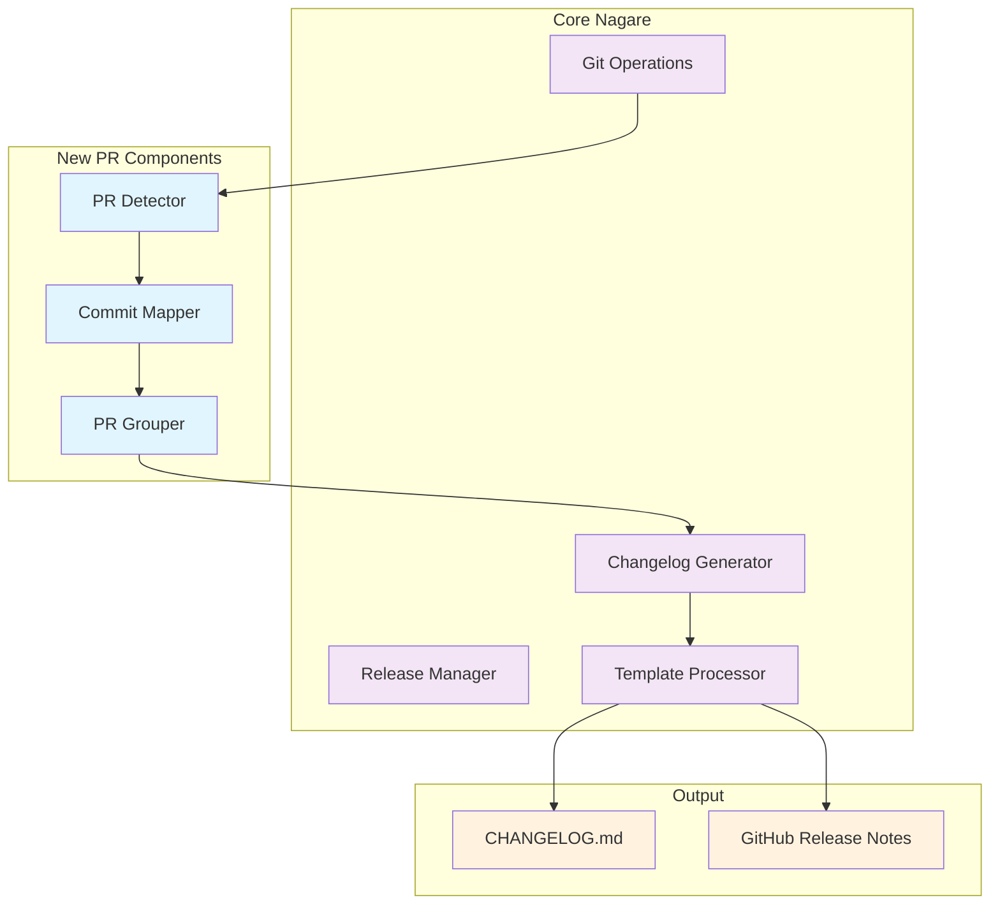
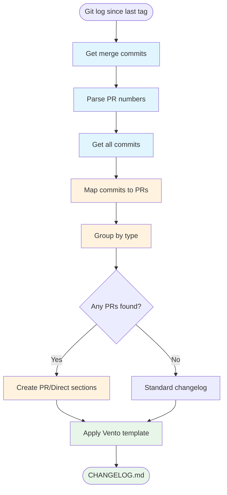
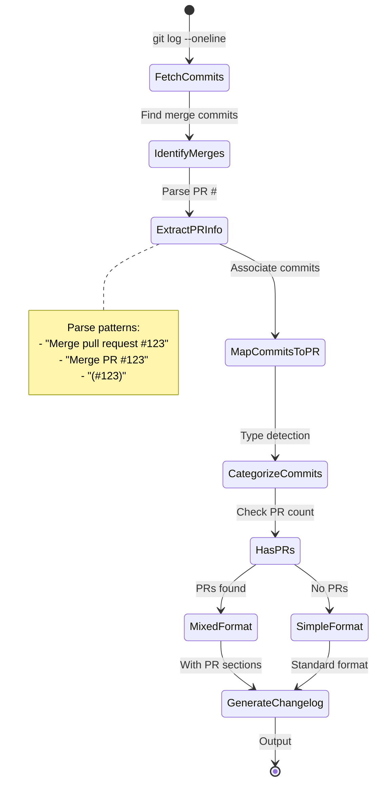

# Architecture: PR-Aware Changelog Generation

## Overview

This document outlines the architectural design for enhancing Nagare's changelog generation to be PR-aware,
automatically detecting and organizing changes by Pull Requests when available.

## Key Architectural Decisions

### 1. Git-Native Approach

- Use git merge commits to detect PRs
- No external API dependencies
- Works offline and in CI environments

### 2. Zero Configuration

- Automatic PR detection
- Mixed mode by default
- "From PRs" sections only appear when PRs exist

### 3. Template Enhancement

- Extend existing Vento templates
- Maintain backward compatibility
- Clean, readable output

## Component Architecture



## Data Flow - PR Detection & Grouping



## PR Detection Algorithm



## Data Structures

```typescript
interface PRInfo {
  number: number;
  title: string;
  commits: Commit[];
  types: Set<CommitType>; // feat, fix, etc.
}

interface ChangelogData {
  version: string;
  date: string;
  sections: {
    features: {
      fromPRs?: PRInfo[];
      direct?: Commit[];
    };
    fixes: {
      fromPRs?: PRInfo[];
      direct?: Commit[];
    };
    // ... other types
  };
}

interface GitOperations {
  // Enhanced with PR detection
  getMergeCommits(since: string): Promise<MergeCommit[]>;
  getPRNumber(mergeCommit: MergeCommit): number | null;
  getCommitsInPR(prNumber: number): Promise<Commit[]>;
}
```

## Template Structure

### When PRs exist (PR-first layout):

```vto
## [{{ version }}] - {{ date }}

### Pull Requests
{{ for pr of pullRequests }}
#### {{ pr.title }} (#{{ pr.number }})
{{ if pr.features && pr.features.length > 0 }}
**Added:**
{{ for commit of pr.features }}
- {{ commit.description }} ({{ commit.sha.slice(0, 7) }})
{{ /for }}
{{ /if }}
{{ if pr.fixes && pr.fixes.length > 0 }}
**Fixed:**
{{ for commit of pr.fixes }}
- {{ commit.description }} ({{ commit.sha.slice(0, 7) }})
{{ /for }}
{{ /if }}
{{ if pr.changes && pr.changes.length > 0 }}
**Changed:**
{{ for commit of pr.changes }}
- {{ commit.description }} ({{ commit.sha.slice(0, 7) }})
{{ /for }}
{{ /if }}
{{ if pr.other && pr.other.length > 0 }}
**Other:**
{{ for commit of pr.other }}
- {{ commit.type }}: {{ commit.description }} ({{ commit.sha.slice(0, 7) }})
{{ /for }}
{{ /if }}

{{ /for }}

{{ if directCommits && directCommits.length > 0 }}
### Direct Commits
{{ if directCommits.features && directCommits.features.length > 0 }}
**Added:**
{{ for commit of directCommits.features }}
- {{ commit.description }} ({{ commit.sha.slice(0, 7) }})
{{ /for }}
{{ /if }}
{{ if directCommits.fixes && directCommits.fixes.length > 0 }}
**Fixed:**
{{ for commit of directCommits.fixes }}
- {{ commit.description }} ({{ commit.sha.slice(0, 7) }})
{{ /for }}
{{ /if }}
{{ /if }}
```

### When no PRs exist (traditional layout):

```vto
## [{{ version }}] - {{ date }}

{{ if features && features.length > 0 }}
### Added
{{ for commit of features }}
- {{ commit.description }} ({{ commit.sha.slice(0, 7) }})
{{ /for }}
{{ /if }}

{{ if fixes && fixes.length > 0 }}
### Fixed
{{ for commit of fixes }}
- {{ commit.description }} ({{ commit.sha.slice(0, 7) }})
{{ /for }}
{{ /if }}

{{ if changes && changes.length > 0 }}
### Changed
{{ for commit of changes }}
- {{ commit.description }} ({{ commit.sha.slice(0, 7) }})
{{ /for }}
{{ /if }}
```

## Implementation Details

### PR Detection Logic

```typescript
// Detect PRs from merge commits
async function detectPRs(since: string): Promise<Map<number, PRInfo>> {
  const mergeCommits = await git.getMergeCommits(since);
  const prMap = new Map<number, PRInfo>();

  for (const merge of mergeCommits) {
    const prNumber = extractPRNumber(merge.message);
    if (prNumber) {
      const commits = await git.getCommitsInPR(prNumber);
      prMap.set(prNumber, {
        number: prNumber,
        title: extractPRTitle(merge.message),
        commits,
        types: new Set(commits.map((c) => c.type)),
      });
    }
  }

  return prMap;
}

// Extract PR number from merge commit message
function extractPRNumber(message: string): number | null {
  const patterns = [
    /Merge pull request #(\d+)/,
    /Merge PR #(\d+)/,
    /\(#(\d+)\)/,
  ];

  for (const pattern of patterns) {
    const match = message.match(pattern);
    if (match) return parseInt(match[1]);
  }

  return null;
}
```

### Commit Grouping

```typescript
function groupCommits(allCommits: Commit[], prs: Map<number, PRInfo>) {
  const prCommitShas = new Set(
    Array.from(prs.values())
      .flatMap((pr) => pr.commits.map((c) => c.sha)),
  );

  const directCommits = allCommits.filter(
    (c) => !prCommitShas.has(c.sha),
  );

  return {
    fromPRs: Array.from(prs.values()),
    direct: directCommits,
  };
}
```

## Performance Considerations

### Git Operations

- Single `git log` call to get all commits
- Parse in-memory rather than multiple git calls
- Cache results during changelog generation

### Template Rendering

- Conditional sections minimize output size
- No empty sections rendered
- Efficient Vento template compilation

## Testing Strategy

```typescript
describe("PR-Aware Changelog", () => {
  test("detects merged PRs correctly");
  test("groups commits by PR");
  test("handles direct commits alongside PRs");
  test('omits "From PRs" section when no PRs exist');
  test("maintains backward compatibility");
  test("handles squash-merge PRs");
  test("handles rebase-merge PRs");
});
```

## Migration Path

### Automatic Enhancement

- Existing changelog generation continues to work
- PR detection activates automatically when PRs detected
- No configuration required

### Rollback

- Template changes are backward compatible
- Can disable PR detection with environment variable if needed:
  ```bash
  NAGARE_DISABLE_PR_DETECTION=true nagare release
  ```

This architecture ensures PR-aware changelogs "just work" without configuration while maintaining simplicity and
performance.
