# Scheduled Actions Feature - Project Status

## Overview

Feature request to add scheduled command execution capabilities to nagare, allowing CI/CD pipelines to run commands at
specific times (e.g., nightly releases).

## Current Status

**Phase**: Planning\
**Status**: 🌱 New\
**Created**: 2024-12-20

## Progress

```mermaid
graph LR
    A[🌱 Planning] --> B[🌿 Design]
    B --> C[🌿 Implementation]
    C --> D[🌳 Testing]
    D --> E[🍃 Complete]
    style A fill:#90EE90
```

## Tasks

- [x] Create project structure
- [x] Move feature request document
- [ ] Review feature requirements
- [ ] Design implementation approach
- [ ] Create implementation plan
- [ ] Implement scheduled actions
- [ ] Add tests
- [ ] Update documentation

## Next Steps

1. Review the feature request details
2. Analyze integration points with existing nagare functionality
3. Design the scheduled actions API
4. Plan implementation phases

## Notes

- Feature originated from user request for CI/CD scheduled releases
- Should integrate cleanly with existing nagare release workflow
- Consider using GitHub Actions cron syntax for familiarity
