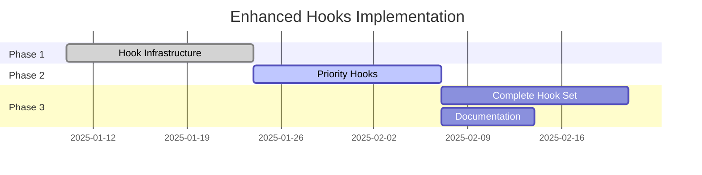

# Implementation Roadmap: Enhanced Hooks

## Phase 1: Foundation (Week 1-2)

🎯 **Goal**: Enhance core hook infrastructure

### Tasks

- [ ] Design `HookContext` interface
- [ ] Add hook execution utilities
- [ ] Implement timeout mechanisms
- [ ] Add `--no-hooks` CLI flag
- [ ] Create hook debugging/dry-run mode

### Deliverables

- Enhanced hook runner with context support
- Comprehensive test suite
- Migration guide for existing hooks

## Phase 2: High-Value Hooks (Week 3-4)

🎯 **Goal**: Implement most requested hooks

### Priority Hooks

1. **`postVersionCalculation`**
   - Validate version before proceeding
   - Check version conflicts
   - Security audit integration point

2. **`postGitHubRelease`**
   - Multi-registry publishing
   - Deployment triggers
   - Notification systems

3. **`onReleaseError`**
   - Custom error reporting
   - Recovery strategies
   - Cleanup operations

### Deliverables

- Working implementations of top 3 hooks
- Documentation with examples
- Integration tests

## Phase 3: Complete Hook Set (Week 5-6)

🎯 **Goal**: Add remaining hooks based on feedback

### Additional Hooks

- File update hooks (pre/post)
- Changelog generation hooks
- Git operation hooks
- Rollback hooks

### Deliverables

- Full hook implementation
- Comprehensive documentation
- Example configurations
- Best practices guide

## Technical Implementation Details

### Hook Context Structure

```typescript
interface HookContext {
  // Timing
  timestamp: Date;
  nagareVersion: string;

  // Configuration
  config: NagareConfig;

  // Hook-specific data
  data: Record<string, unknown>;

  // Utilities
  utils: {
    log: (message: string) => void;
    exec: (command: string) => Promise<CommandResult>;
    readFile: (path: string) => Promise<string>;
    writeFile: (path: string, content: string) => Promise<void>;
  };
}
```

### Hook Registration

```typescript
export interface NagareConfig {
  // Existing hooks (backwards compatible)
  hooks?: {
    preRelease?: Array<() => Promise<void>>;
    postRelease?: Array<() => Promise<void>>;
  };

  // New enhanced hooks
  enhancedHooks?: {
    [hookName: string]: Array<(context: HookContext) => Promise<void>>;
  };
}
```

## Success Metrics

1. **Adoption**: 25% of Nagare users adopt new hooks within 3 months
2. **Stability**: Zero breaking changes to existing hooks
3. **Performance**: Hook overhead < 5% of total release time
4. **Documentation**: 100% of hooks have examples
5. **Testing**: 90%+ code coverage for hook system

## Risk Mitigation

| Risk                 | Impact          | Mitigation                      |
| -------------------- | --------------- | ------------------------------- |
| Too complex          | Users confused  | Phased rollout, extensive docs  |
| Performance impact   | Slow releases   | Timeouts, parallel execution    |
| Breaking changes     | User disruption | Careful API design, deprecation |
| Debugging difficulty | Poor DX         | Enhanced logging, dry-run mode  |

## Timeline Summary


