# Documentation Structure Migration Status

## Project: Migrate /references to /docs and Auto-Generated Docs to /docs/api

**Started**: 2025-01-09 **Status**: 🍃 Complete **Type**: Repository Restructure

## Current Phase

[Planning] → [Execution] → [Validation] → [**Complete**] ▲

## Progress

Week 1/1 ████████████████████ 100% 🍃

## Status Diagram

```mermaid
graph LR
    A[🌱 Planning] --> B[🌿 Execution]
    B --> C[🌳 Validation]
    C --> D[🍃 Complete]
    style D fill:#90EE90
```

## Objectives

- [x] Analyze current /docs directory structure and usage
- [x] Move auto-generated API docs from /docs to /docs/api
- [x] Rename /references to /docs
- [x] Update all configuration files and scripts
- [x] Update documentation references
- [x] Verify Deno Deploy compatibility

## Migration Plan

### Phase 1: Analysis

- [ ] Inventory current /docs content
- [ ] Find all references to /docs in codebase
- [ ] Identify configuration files that need updates

### Phase 2: Migration

- [ ] Create /docs/api directory
- [ ] Move auto-generated docs to /docs/api
- [ ] Move /references content to /docs
- [ ] Update nagare.config.ts docs output path
- [ ] Update any scripts that reference docs paths

### Phase 3: Configuration Updates

- [ ] Update GitHub workflows
- [ ] Update any deployment configurations
- [ ] Update documentation that references paths

### Phase 4: Validation

- [ ] Test doc generation works with new paths
- [ ] Verify all links still work
- [ ] Confirm Deno Deploy compatibility

## Next Steps

1. Execute comprehensive analysis of current state
2. Perform migration in parallel tasks
3. Update all references
4. Test and validate changes
