# Plans Reorganization Status

## Project: Repository Documentation Reorganization

**Completed**: 2025-01-09 **Status**: 🍃 Complete **Type**: Repository Cleanup

## Status Diagram

```mermaid
graph LR
    A[🌱 Started] --> B[🌿 Active]
    B --> C[🌳 Review]
    C --> D[🍃 Complete]
    style D fill:#90EE90
```

## Summary

Successfully reorganized the `/plans` directory into a more structured approach:

### Created `/references` Directory

Moved 7 permanent reference documents that serve as ongoing project documentation:

- `RESEARCH_TEMPLATE.md` - Template for research documentation
- `alternative-commit-conventions.md` - Reference for commit conventions
- `github-security-setup.md` - Security configuration guide
- `salty-upgrade-guide.md` - Migration guide from Salty
- `jsr-transform-example.md` - JSR transformation examples
- `vento-feedback.md` - Vento template engine findings
- `claude-md-usage-research.md` - CLAUDE.md usage patterns

### Organized Completed Projects

Moved 8 completed projects to `.claude/output/done-*` folders:

- File handlers implementation
- Template-based file generation
- Changelog deletion fix
- Git operations test fix
- JSR text import workaround
- Documentation deployment
- Extending version files feature

### Organized Active Projects

Moved 2 active projects to `.claude/output/active-*` folders:

- i18n implementation (grouped 2 related documents)
- Claude Code scheduled actions feature request

### Impact

- Cleaner repository structure
- Clear separation between references and projects
- Better tracking of project status with Aichaku methodology
- Removed empty `/plans` directory

## Key Achievement

Successfully implemented the distinction between:

- **Reference documents**: Permanent guides and specifications in `/references`
- **Project documents**: Time-bound work in `.claude/output/`
