# Getting Started with Nagare

In this tutorial, you'll learn how to use Nagare to automate your first software release. By the end, you'll have
created a tagged release with an auto-generated changelog and updated version files.

## Prerequisites

Before you begin, ensure you have:

- [Deno](https://deno.land/) installed (version 2.4 or higher)
- Git installed and configured
- A GitHub account (for creating GitHub releases)
- GitHub CLI (`gh`) installed and authenticated
- Basic familiarity with the command line

## What you'll learn

- How to install and initialize Nagare
- How to configure version file updates
- How to create your first automated release
- How to review generated changelogs
- How to troubleshoot common issues

## Tutorial Flow

```mermaid
graph TD
    A[📋 Prerequisites Check] --> B[🔧 Initialize Nagare]
    B --> C[⚙️ Configure Version Files]
    C --> D[📝 Make Conventional Commits]
    D --> E[🧪 Test with Dry Run]
    E --> F[🚀 Create First Release]
    F --> G[📊 Review Results]
    G --> H[🎉 Success!]
    
    style A fill:#e1f5fe
    style B fill:#e8f5e8
    style C fill:#fff3e0
    style D fill:#f3e5f5
    style E fill:#e0f2f1
    style F fill:#fff8e1
    style G fill:#fce4ec
    style H fill:#e8f5e8
```



## Step 1: Initialize Nagare in your project

Navigate to your project directory and run the initialization command:

```bash
deno run -A jsr:@rick/nagare/cli init
```

This command will:

- Create a `nagare-launcher.ts` file for local configuration
- Generate a minimal `nagare.config.ts` if one doesn't exist
- Show you which tasks to add to your `deno.json`

**Expected output:**

```
🚀 Initializing Nagare in your project...
✅ Created nagare-launcher.ts
✅ Created nagare.config.ts
✅ Setup complete!

Add these tasks to your deno.json:
{
  "tasks": {
    "nagare": "deno run -A nagare-launcher.ts",
    "nagare:patch": "deno task nagare patch",
    "nagare:minor": "deno task nagare minor",
    "nagare:major": "deno task nagare major",
    "nagare:dry": "deno task nagare --dry-run"
  }
}
```

## Step 2: Add tasks to your deno.json

Copy the suggested tasks into your `deno.json` file:

```json
{
  "tasks": {
    "nagare": "deno run -A nagare-launcher.ts",
    "nagare:patch": "deno task nagare patch",
    "nagare:minor": "deno task nagare minor",
    "nagare:major": "deno task nagare major",
    "nagare:dry": "deno task nagare --dry-run",
    "nagare:rollback": "deno task nagare rollback"
  }
}
```

## Step 3: Configure your project

Open the generated `nagare.config.ts` file and customize it for your project:

```typescript
import type { NagareConfig } from "jsr:@rick/nagare/types";

export default {
  project: {
    name: "My Awesome App",
    repository: "https://github.com/yourusername/my-awesome-app",
    description: "A fantastic Deno application",
    license: "MIT",
  },

  versionFile: {
    path: "./version.ts",
    template: "typescript",
  },

  github: {
    owner: "yourusername",
    repo: "my-awesome-app",
    createRelease: true,
  },

  // Update additional files during releases
  updateFiles: [
    { path: "./deno.json" },
    { path: "./README.md" },
    { path: "./jsr.json" },
  ],
} as NagareConfig;
```

## Step 4: Make some changes

Create a commit using conventional commit format to trigger a release:

```bash
# Add a new feature
echo 'export function newFeature() { return "Hello World!"; }' >> src/index.ts

# Commit with conventional commit message
git add .
git commit -m "feat: add new feature function"
```

## Step 5: Preview your first release

Before creating an actual release, preview what Nagare will do:

```bash
deno task nagare:dry
```

**Expected output:**

```
🚀 Nagare Release Manager - Dry Run Mode
📋 Current version: 1.0.0
🔍 Analyzing commits since last release...

📝 Commits since v1.0.0:
  - feat: add new feature function

📊 Version bump: minor (1.0.0 → 1.1.0)

📄 Files to update:
  ✓ version.ts
  ✓ deno.json
  ✓ README.md
  ✓ jsr.json
  ✓ CHANGELOG.md

🏷️  Would create tag: v1.1.0
📢 Would create GitHub release: v1.1.0

✅ Dry run complete. No changes were made.
```

## Step 6: Create your first release

Now create the actual release:

```bash
deno task nagare
```

Follow the interactive prompts:

```
🚀 Nagare Release Manager
📋 Current version: 1.0.0
🔍 Analyzing commits...
📊 Recommended version: 1.1.0 (minor bump)

? Proceed with release v1.1.0? (Y/n) Y
```

**Expected output:**

```
✅ Updated version.ts
✅ Updated deno.json
✅ Updated README.md
✅ Updated jsr.json
✅ Updated CHANGELOG.md
✅ Created commit: "chore(release): bump version to 1.1.0"
✅ Created tag: v1.1.0
✅ Pushed changes to origin
✅ Created GitHub release

🎉 Release v1.1.0 completed successfully!
```

## Step 7: Review the results

Check what Nagare created:

### Updated version files

```bash
# Check the version in version.ts
cat version.ts
```

**Expected output:**

```typescript
export const VERSION = "1.1.0";
export const BUILD_INFO = {
  buildDate: "2025-07-18T20:30:00.000Z",
  gitCommit: "abc1234def5678",
};
```

### Generated changelog

```bash
cat CHANGELOG.md
```

**Expected output:**

```markdown
# Changelog

All notable changes to this project will be documented in this file.

The format is based on [Keep a Changelog](https://keepachangelog.com/en/1.1.0/), and this project adheres to
[Semantic Versioning](https://semver.org/spec/v2.0.0.html).

## [1.1.0] - 2025-07-18

### Added

- feat: add new feature function

## [1.0.0] - 2025-07-18

### Added

- Initial release

[1.1.0]: https://github.com/yourusername/my-awesome-app/compare/v1.0.0...v1.1.0
[1.0.0]: https://github.com/yourusername/my-awesome-app/releases/tag/v1.0.0
```

### Git history

```bash
git log --oneline -n 3
```

**Expected output:**

```
abc1234 chore(release): bump version to 1.1.0
def5678 feat: add new feature function
ghi9012 Initial commit
```

## Summary

You've successfully learned how to:

- Initialize Nagare in your project with proper configuration
- Set up automated version file updates
- Create releases using conventional commits
- Generate professional changelogs automatically
- Publish GitHub releases with detailed release notes

You now understand how Nagare:

- Analyzes commit history to determine appropriate version bumps
- Updates version strings across multiple files consistently
- Generates Keep a Changelog format documentation
- Creates Git tags and GitHub releases automatically

## Next steps

- Learn [How to configure advanced file updates](../how-to/configure-file-updates.md)
- Explore [How to use custom templates](../how-to/use-custom-templates.md)
- Read [Understanding version bumps](../explanation/version-bumps.md) for semantic versioning mastery
- Try [How to set up CI/CD integration](../how-to/setup-ci-cd.md)

## Troubleshooting

**Problem**: "Command not found: deno"\
**Solution**: Install Deno from [deno.land](https://deno.land/). Ensure it's in your PATH.

**Problem**: "No commits found for version bump"\
**Solution**: Use [conventional commits](https://www.conventionalcommits.org/). Start commit messages with `feat:`,
`fix:`, or include `BREAKING CHANGE:`.

**Problem**: "GitHub release creation failed"\
**Solution**: Authenticate with GitHub CLI: `gh auth login`

**Problem**: "File update pattern not matching"\
**Solution**: Use built-in file handlers or check regex patterns with line anchors.
